# Blazor Podcast AI

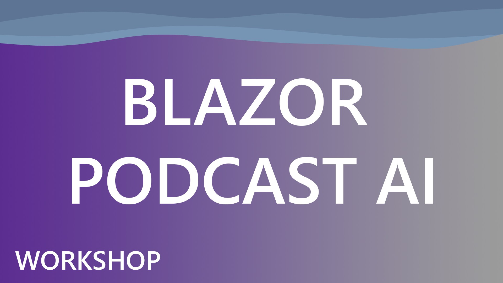

## Code

You can **Clone** or **Download** this **Repository** from **GitHub** for the **Code** for the **Workshop**

## Contents

* **[Setup & Start](#setup--start)**
* [Install .NET SDK](#install-net-sdk)
* [Create Project](#create-project)
* [Install Visual Studio Code](#install-visual-studio-code)
* [Launch Visual Studio Code](#launch-visual-studio-code)
* [Update Project](#update-project)
* [Create GitHub Account](#create-github-account)
* [Get Personal Access Token](#get-personal-access-token)
* [Launch Project in Browser](#launch-project-in-browser)
* **[Implement](#implement)**
* [Provider Class](#provider-class)
* [Item Component](#item-component)
* [Send Component](#send-component)
* [Home Component](#home-component)
* **[Generate](#generate)**
* [Podcast Assistant](#podcast-assistant)
* [Custom Assistant](#custom-assistant)

## Setup & Start

### Install .NET SDK

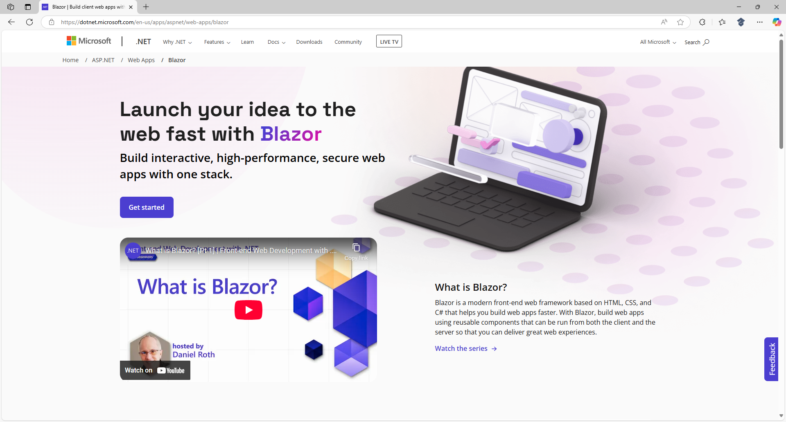

> **Information** - **Blazor** is the front-end framework from **Microsoft** based on **HTML**, **CSS** and **C#** using **.NET** to build web or hybrid mobile and desktop applications. To find out more about **Blazor** visit [blazor.net](https://blazor.net).

First you will need to **Download** the latest **.NET SDK**, do so use a **Browser** and visit the **Website** at [dot.net](https://dot.net).

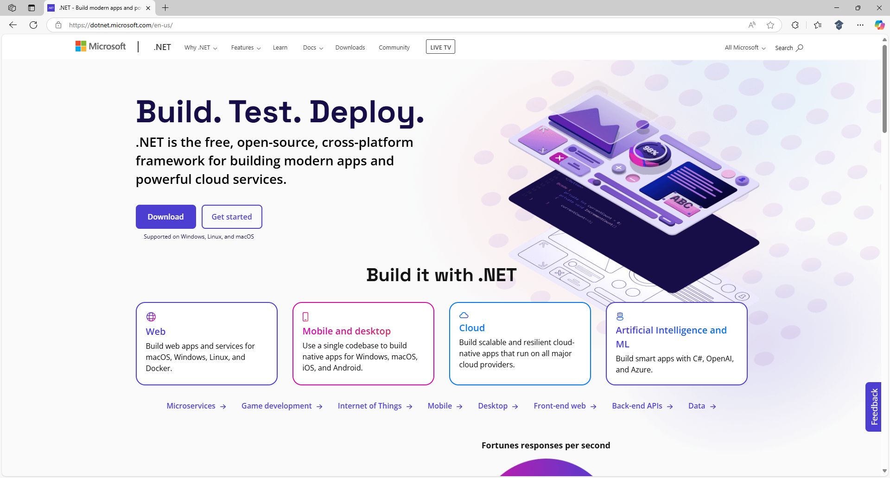

> **Information** - **.NET** is the is the free, open-source framework from **Microsoft** to build modern applications for web with **Blazor** and **ASP.NET Core**, for mobile with **.NET MAUI**, for cloud with **.NET Aspire** and more.

Then choose **Download** which should display the **.NET SDK** for your platform of **Windows** or **Mac**.

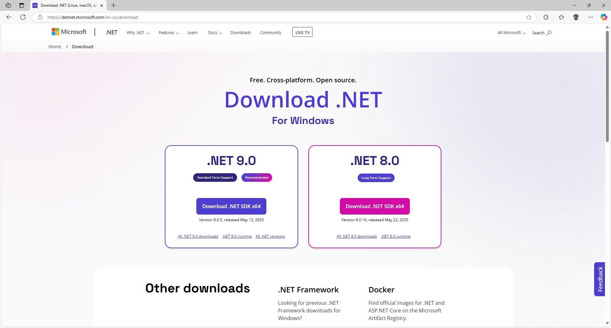

Next select **Download** for the .**NET SDK** for **.NET 9.0** which varies based on your exact platform of **Mac** or **Windows** for example **Download .NET SDK x64** although your exact **Version** may be different or newer.

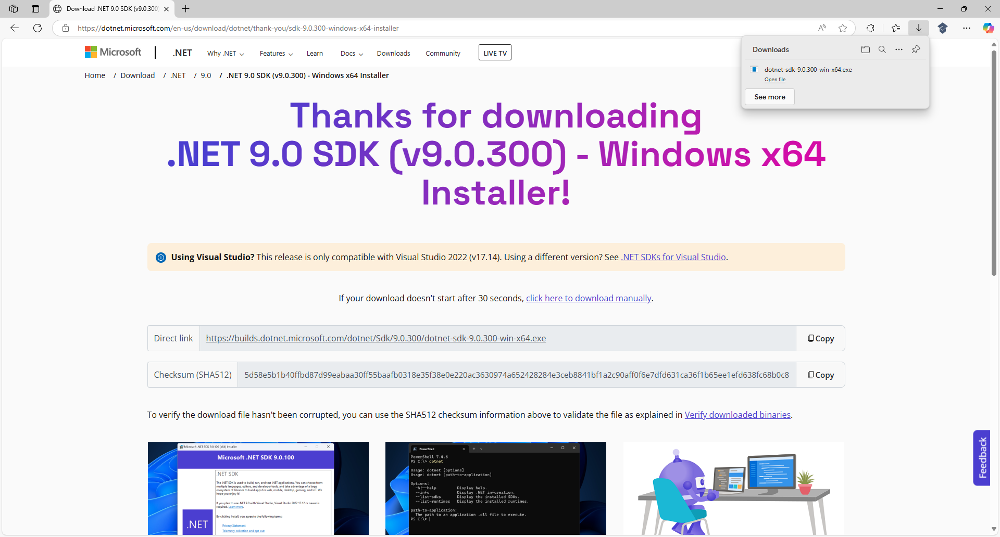

> **Information** - **.NET 9.0 SDK** here is _v9.0.300_ for _Windows x64_ which was the one used for this **Workshop**.

Then the **Installer** for **.NET SDK** will begin **Downloading** and once it has been **Downloaded** it will show in **Downloads** for your **Browser** where you can **Open** it to launch the **Installer** for **.NET SDK** as follows:

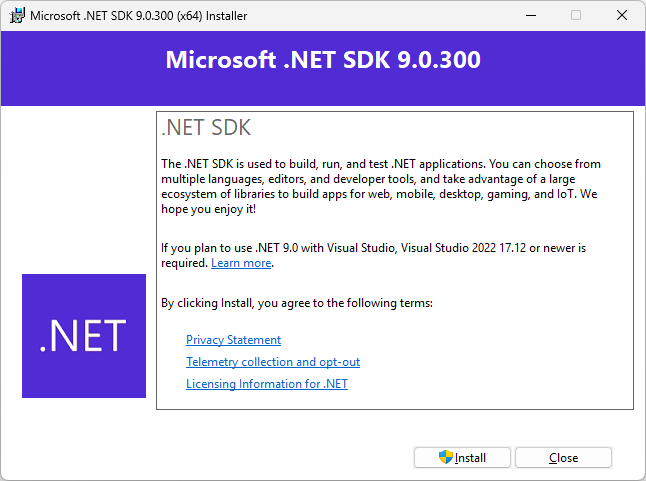

After **Opening** the **Installer** for the **.NET SDK** select **Install** to begin the installation process for **.NET SDK**.

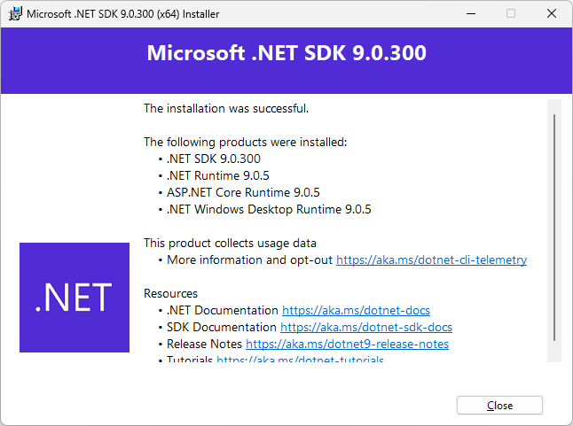

Finally, when installation has completed for the **.NET SDK**, you can select **Close** in the **Installer** as this completes the process of **Downloading** and **Installing** the **.NET SDK** for **Windows** or **Mac**.

### Create Project

Once **.NET SDK** has been **Installed** you will need to create a **Project** using **Blazor**, to do this, if using **Mac** you need to go to **Finder**, search for **Terminal** and then select it to **Open** it, or if using **Windows** you need to go to **Start**, search for **Command Prompt** and then select it to **Open** it as follows:

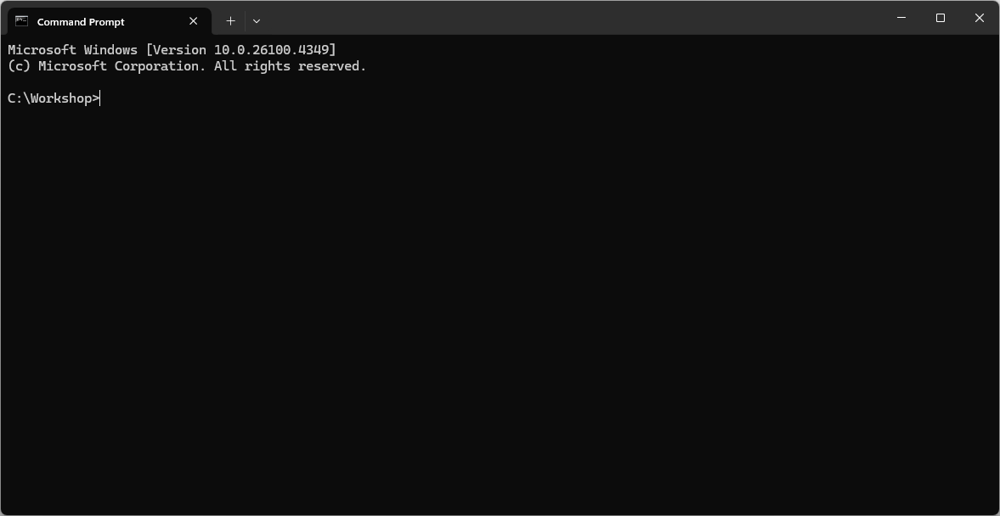

> **Information** – You can choose a different location for the **Project** in **Terminal** on **Mac** or **Command Prompt** on **Windows** if needed, but the default location should be fine for the **Workshop**.

Then you will need to create the **Project** using the **.NET SDK**, to do this from the **Terminal** on **Mac** or **Command Prompt** on **Windows** you need to _Copy_ and _Paste_ the following **Command** then press **Enter**:

```
dotnet new blazorwasm -o Blazor.Podcast.AI
```

> **Information** – This will create a **Project** using **Blazor** **WebAssembly** called **Blazor.Podcast.AI** which is a special kind of application using **Blazor** that runs in your **Browser**.

Once the **Project** for **Blazor.Podcast.AI** which uses the template **Blazor WebAssembly Standalone App** has been created successfully, then within the **Terminal** on **Mac** or **Command Prompt** on **Windows** you need to switch to the **Folder** for the **Project** of **Blazor.Podcast.AI**. To do this _Copy_ and _Paste_ the following **Command** and then press **Enter**:

```
cd Blazor.Podcast.AI
```

> **Information** – The **Command** of **cd** means change directory which is common to both the **Terminal** on **Mac** and **Command Prompt** on **Windows** to switch to a specified **Folder**.

Once done you should have switched to the **Folder** for the **Project** of **Blazor.Podcast.AI** as follows:

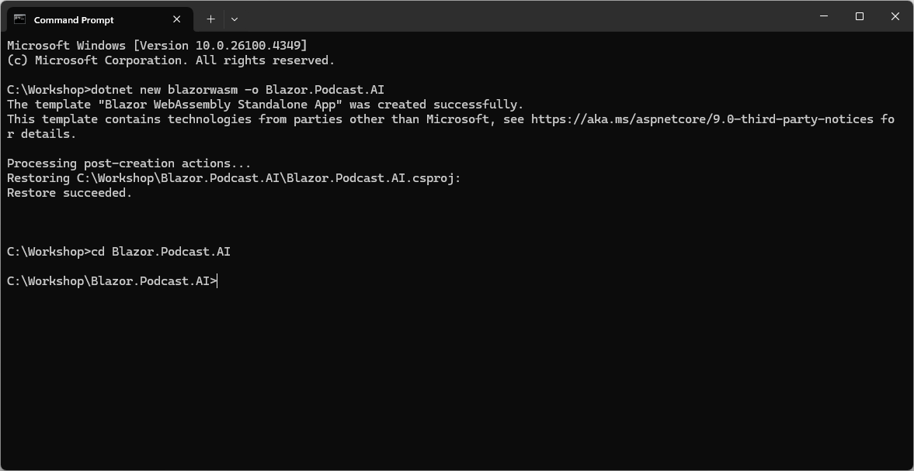

Then to add the **Package** for **Microsoft.Extensions.AI.OpenAI** you need to _Copy_ and _Paste_ the following **Command** and then press **Enter**:

```
dotnet add package Microsoft.Extensions.AI.OpenAI --prerelease
```

> **Information** – This will add the **Package** for **Microsoft.Extensions.AI.OpenAI** allowing it to be used within the **Project** for the **Blazor** application. This **Package** integrates **AI** **Models** from **OpenAI** and is part of the broader Microsoft.Extensions.AI ecosystem that provides a unified way of working with AI services in **.NET**. To find out more about the **Package** you can visit [nuget.org/packages/Microsoft.Extensions.AI.OpenAI](https://nuget.org/packages/Microsoft.Extensions.AI.OpenAI).

Don’t **Close** the **Terminal** on **Mac** or **Command Prompt** on **Windows** as you’ll need it throughout the **Workshop** and to know what **Folder** to **Open** later in the **Workshop**, for example in this case it would be _C:\\Workshop\\Blazor.Podcast.AI_.

Once the **Command** has completed in **Terminal** on **Mac** or **Command Prompt** on **Windows** this completes the process of creating the **Project** of **Blazor.Podcast.AI.** and adding the **Package**.

### Install Visual Studio Code

You will need to **Download** the latest **Visual Studio Code** for **Windows** or **Mac**, to do this use a **Browser** and visit the **Website** at [code.visualstudio.com](https://code.visualstudio.com) where you’ll also find out more about **Visual Studio Code**.

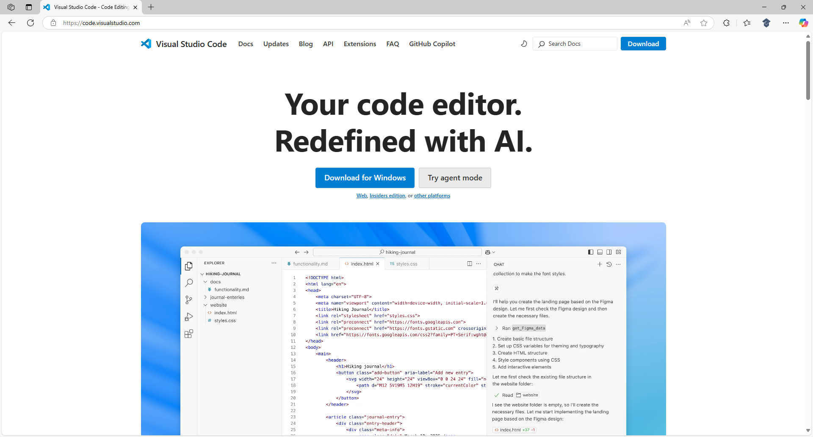

> **Information** – **Visual Studio Code** is the free and open-source code editor with support for every major programming language including **C#** which is used with **.NET** and with optional support for AI features.

Next select the **Download for Windows** option in this case for **Windows** or the option to **Download** for **Mac** although your exact **Version** of **Visual Studio Code** may be different or newer.

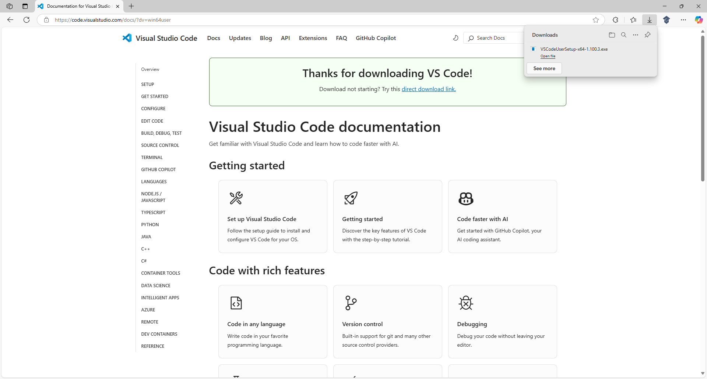

The **Installer** for **Visual Studio Code** will begin **Downloading** and once it has been **Downloaded** it will show in **Downloads** in your **Browser** where you can **Open** it to launch the **Installer** as follows:

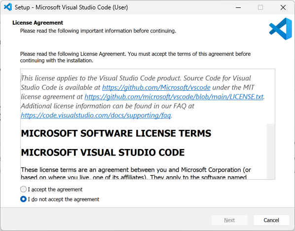

You will need to select **I accept the agreement** and then select **Next** and keep selecting **Next** for the rest of the **Installer** as you don’t need to change anything, once you get to the end select **Finish** as follows:

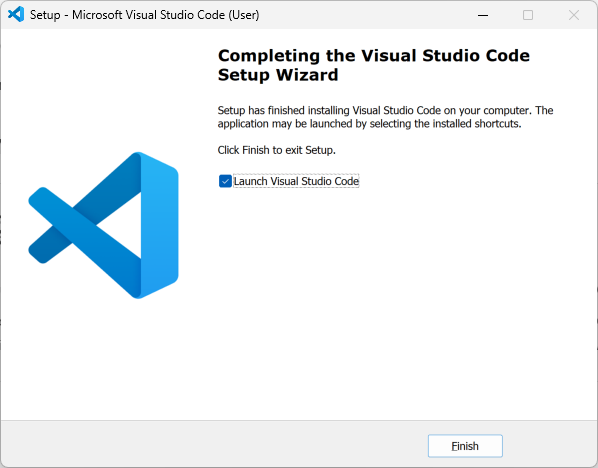

### Launch Visual Studio Code

Once you have installed **Visual Studio Code** the **Installer** will have launched **Visual Studio Code**, but if **Visual Studio Code** was already **Installed**, then on **Mac** you need to go to **Finder** and then search for **Visual Studio Code** and then select it to **Launch** it, or if using **Windows** you need to go to **Start**, and then search for **Visual Studio Code** and then select it to **Launch** it as follows:

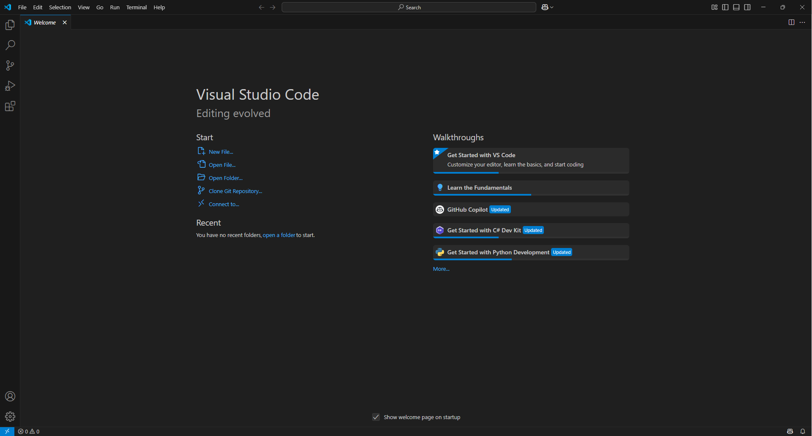

Then in **Visual Studio Code** from the **Side Bar** select the top option of **Explorer** as follows:

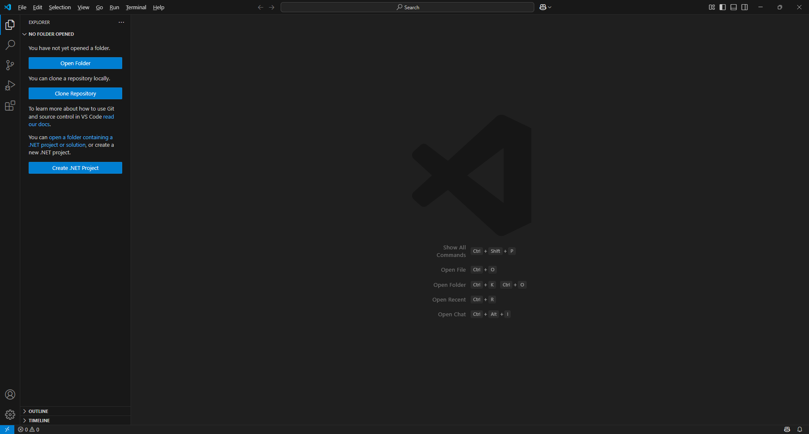

Next in **Visual Studio Code** within **Explorer** select **Open Folder** and locate the **Folder** for your **Project**, this will be the one in **Terminal** on **Mac** or **Command Prompt** on **Windows** e.g. _C:\Workshop\Blazor.Podcast.AI_ and then choose **Select Folder** or if you cannot find it _Type_ in the **Terminal** on **Mac** or **Command Prompt** on **Windows** the **Command** of `code .` followed by **Enter**, which should open the **Folder** as follows:

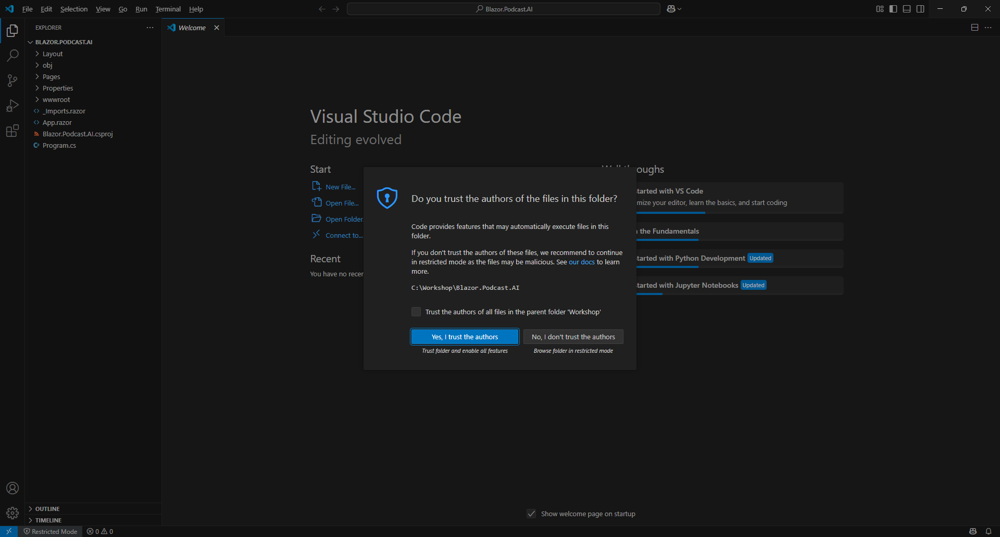

Then choose **Yes, I trust the authors** in **Do you trust the authors of the files in this folder?** as this is the **Folder** for the **Project** you created and then once done select **Program.cs** from **Explorer** as follows:

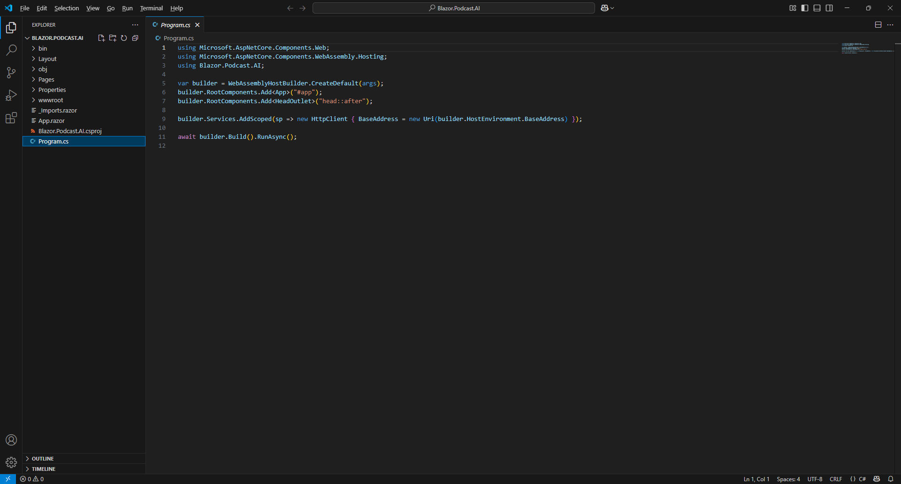

> **Information** – **Program.cs** is where the application is **Initialised** you will see `using` statements at the top for features in **.NET** or **Packages** along with `WebAssemblyHostBuilder` which is set up by default.

### Update Project

Return to **Visual Studio Code** and with **Program.cs** selected in **Explorer** you will need to add some **using** statements, so below the line of **using Blazor.Podcast.AI** or the last **using** statement you need to _Copy_ and _Paste_ the following **Usings**:

```csharp
using OpenAI;
using System.ClientModel;
using Microsoft.Extensions.AI;
```

> **Information** – The first `using` statement will include functionality to use **OpenAI**, the next is needed for the **Credentials** and the last for functionality needed from the **Package** of **Microsoft.Extensions.AI.OpenAI**.

Then within **Program.cs** above the line of `await builder.Build().RunAsync();` you need to _Copy_ and _Paste_ the following **Code**:

```csharp
var credential = new ApiKeyCredential("PersonalAccessToken");
var options = new OpenAIClientOptions() 
{ 
    Endpoint = new Uri("https://models.inference.ai.azure.com") 
}; 
var client = new OpenAIClient(credential, options);
var chat = client.GetChatClient("gpt-4o-mini").AsIChatClient();
builder.Services.AddSingleton(chat);
// Register Provider

```

> **Information** – This **Code** is for the **Client** needed to use **GitHub Models**, starting with `ApiKeyCredential` with a placeholder for a **Personal Access Token** to be provided later in the **Workshop**. This is followed by an `OpenAIClientOptions` created with the **Endpoint** needed to access **GitHub Models**. Then there is an `OpenAIClient` using `ApiKeyCredential` and `OpenAIClientOptions` used to set up `IChatClient` which will use the **AI Model** from **OpenAI** of **GPT-4o Mini**. This is **Registered** with **Dependency Injection** where functionality such as `IChatClient` can be provided where it is needed. Finally, there is a **Comment** for `Register Provider` in **Program.cs** which will be returned to later when the **Provider** has been **Implemented** in the **Workshop** to **Register** it for **Dependency Injection**.

Once you have updated **Program.cs** with **Usings** and **Code** in **Visual Studio Code** it should be as follows:

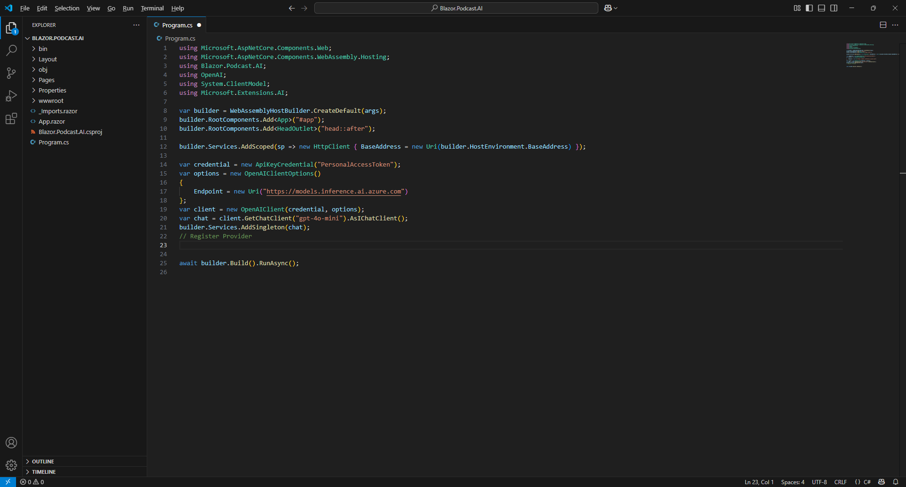

**Visual Studio Code** will need to be kept **Open** throughout the **Workshop** but don’t worry if you **Close** it by mistake as you can just **Launch** it again by, if using a **Mac** you need to go to **Finder**, search for **Visual Studio Code** and then select it, or if using **Windows** you need to go to **Start**, search for **Visual Studio Code** and select it so that **Visual Studio Code** is **Opened** again. Then from **Welcome** in **Visual Studio Code** select **Blazor.Podcast.AI** from **Recent** and then select **Program.cs** from **Explorer**.

This completes **Visual Studio Code** being **Installed** and / or **Launched** for **Windows** or **Mac** along with opening the **Project** for **Blazor.Podcast.AI** and updating **Program.cs** as needed for **GitHub Models**.

### Create GitHub Account

If you don’t have an existing **GitHub Account** you will need to **Sign up** for one, to do so use a **Browser** and visit the **Website** at [github.com](https://github.com/) which also includes more about **GitHub**.

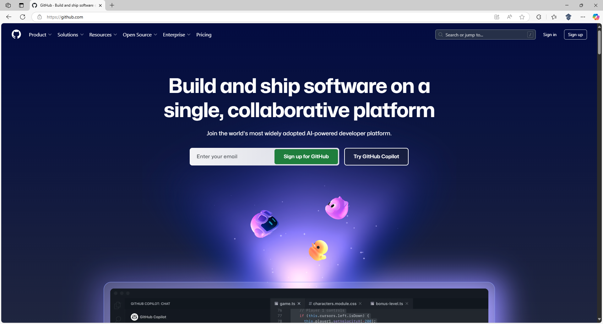

> **Information** – **GitHub** is where you can collaboratively store and share code for any language or platform such as **.NET** with **Repositories** where you can track and propose changes to help build and ship software.

Then select **Sign up** where you can input your **Email** then a **Password** and **Username** to use for **GitHub** along with your **Country/Region** such as **United Kingdom** and then select **Continue**.

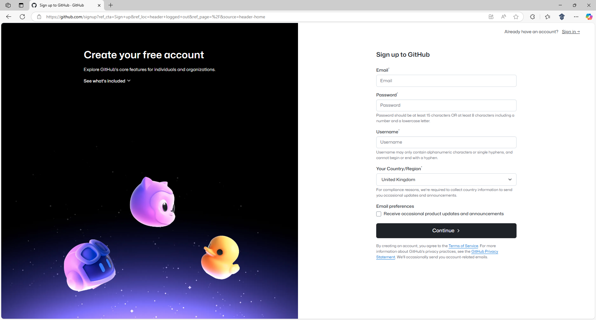

Then you may be asked to **Verify** your **Account** and then to **Confirm** the **Email Address** for your **Account**.

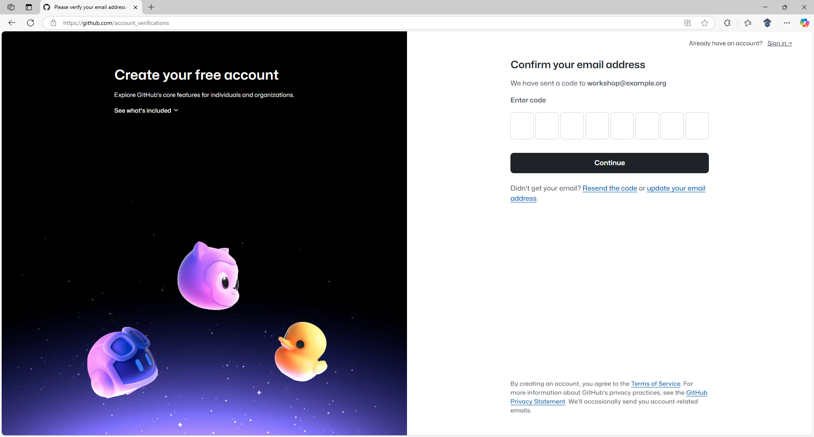

Next you need to check your **Email** for one for **Your GitHub launch code** that would have been **Sent** to the **Email Address** you provided for your new **Account** which you can then _Copy_ and _Paste_ below **Enter Code** on the **Confirm your email address** and then select **Continue** to create your **GitHub Account**.

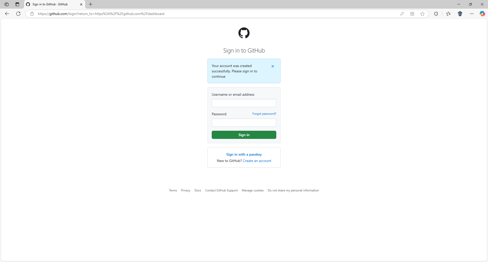

> **Information** – This completes creating a new **GitHub Account** than can then be used to get a **Personal Access Token** to access **GitHub Models**.

### Get Personal Access Token

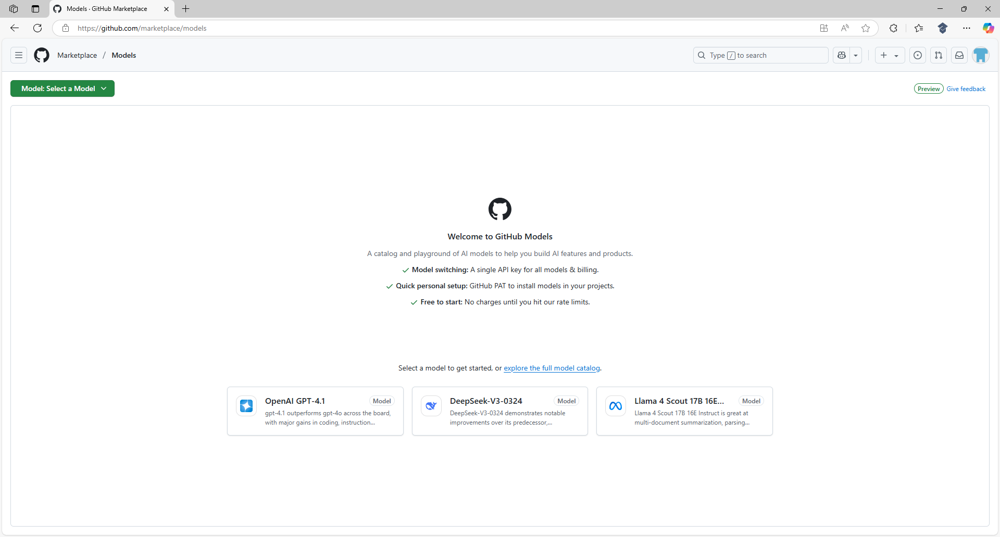

> **Information** – **GitHub Models** is a catalogue and playground for **AI Models** including those from **OpenAI** to help build AI features and products easily accessed using a single **Endpoint** and **Personal Access Token** from **GitHub**. You can find out more about **GitHub Models** or try them out at [github.com/models](https://github.com/models).

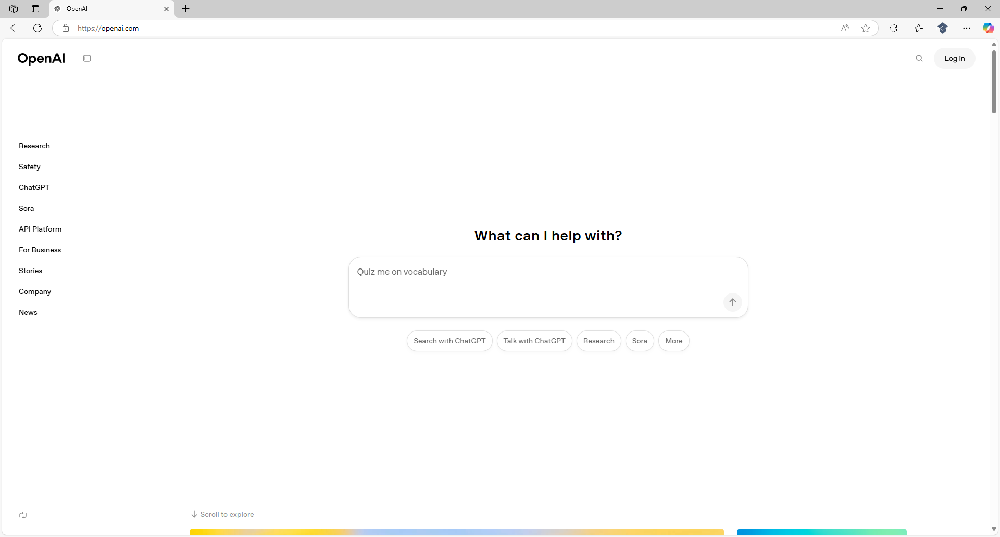

> **Information** - **OpenAI** develops advanced **AI Models** including GPT or Generative Pre-trained Transformer that powers services such as ChatGPT that can understand and generate human-like text or DALL·E that can be used to create realistic images from text descriptions. To find out more about **OpenAI** visit [openai.com](https://openai.com).

If you have a **GitHub Account**, use a **Browser** and visit the **Website** at [github.com](https://github.com/) and select **Sign in**, or once you have created your **GitHub Account** input your **Username or email address** and **Password**.

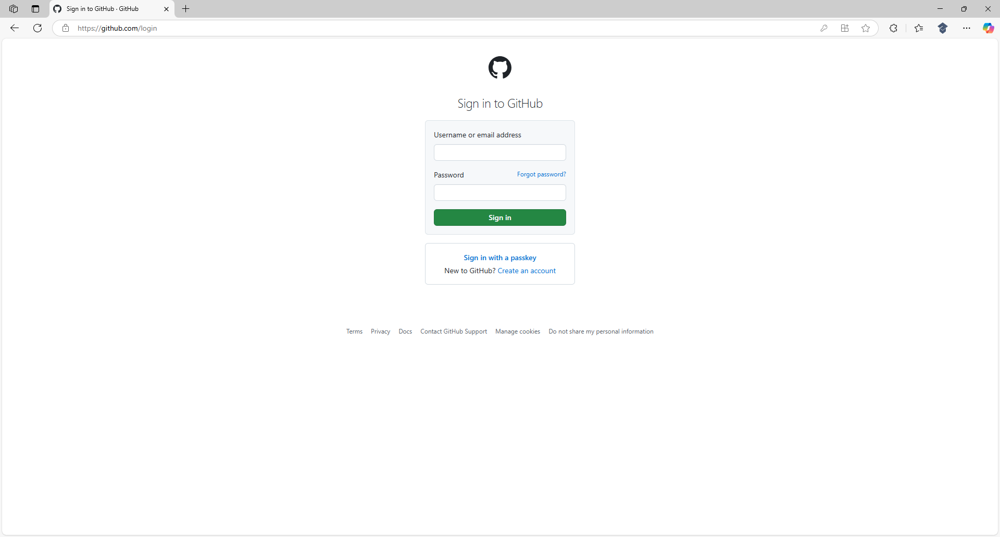

Then select **Sign in** to your **GitHub Account** and once done you will be taken to the **Dashboard** as follows:

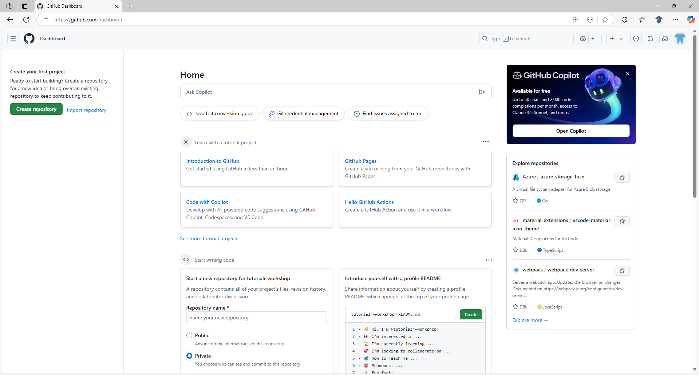

> **Information** – **Dashboard** is where you get started with **GitHub** including being able to create your own **Repositories** where you can store and share any **Code** including being able to collaborate with others or contribute **Code** to others on **GitHub**.

Once in the **Dashboard** for your **GitHub** **Account** select the **Avatar** from the top of the **Dashboard** to display the **Account Menu** as follows:

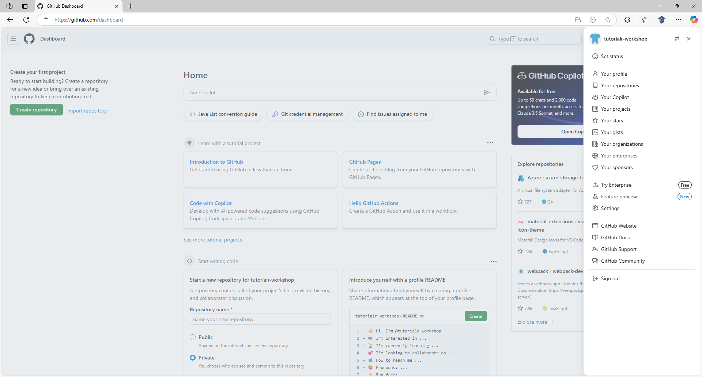

Then from the **Account Menu** select **Settings** to display the **Settings** for your **GitHub Account**.

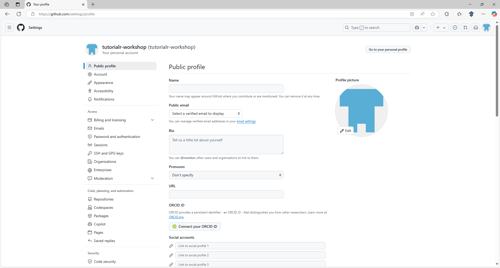

Next from **Settings** select **Developer settings** from the bottom of the options that includes **Public profile**.

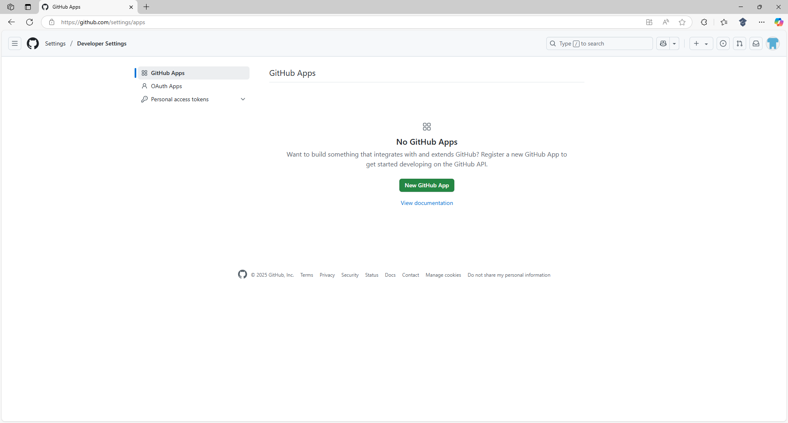

Then in **Developer Settings** select **Personal access tokens** and then select **Fine-grained tokens**.

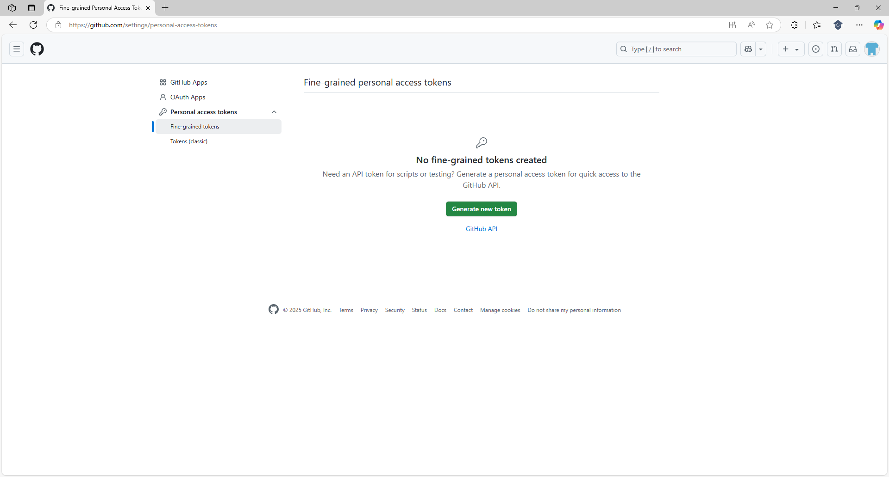

> **Information** – This is where **Personal Access Tokens** are created needed to access **GitHub Models**.

Next in **Fine-grained tokens** select **Generate new token** and then enter a **Token name** which can be anything unique to your **GitHub Account**, for example _GitHub Models_, as follows:

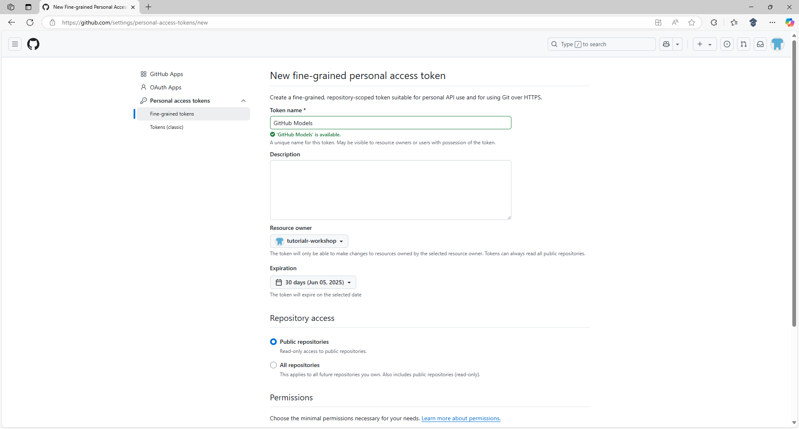

Then at the bottom of **New fine-grained personal access token** select **Account permissions** and then next to **Models** select **Access** and choose the **Read-only** option as follows:

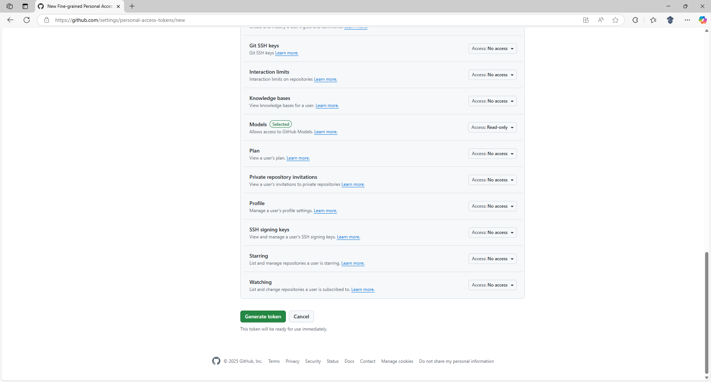

> **Information** – This will give the **Personal Access** **Token** to be created **Permission** to use **GitHub Models**.

Next at the bottom of **New fine-grained personal access token** select **Generate token** and in **New personal access token** select **Generate token** as follows:

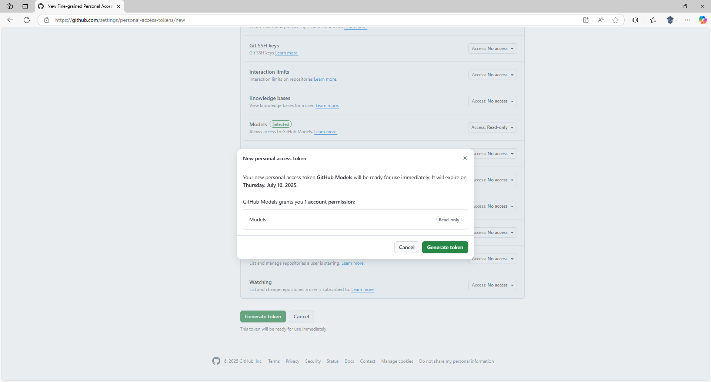

Once **Generate token** has been selected the **Personal Access Token** will be created as follows:

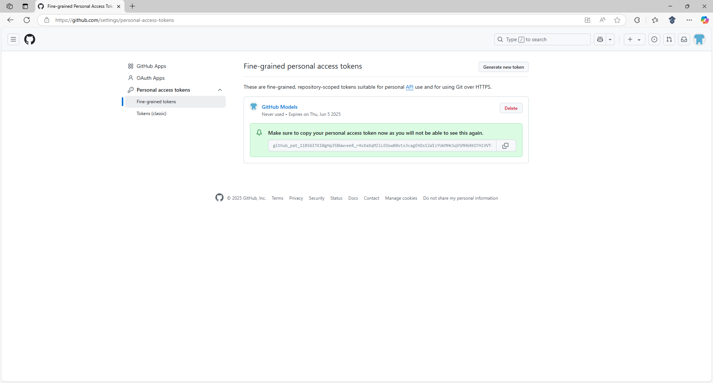

> **Information** – This **Personal Access Token** only has **Permission** to access **GitHub Models** so it won’t be able to do anything to your **GitHub Account**, but you should keep it secret and not share it with anyone.

Then you need to _Copy_ the **Personal Access Token** from **Fine-grained personal access tokens** and return to **Visual Studio Code** where **Program.cs** should be selected in **Explorer** as follows:

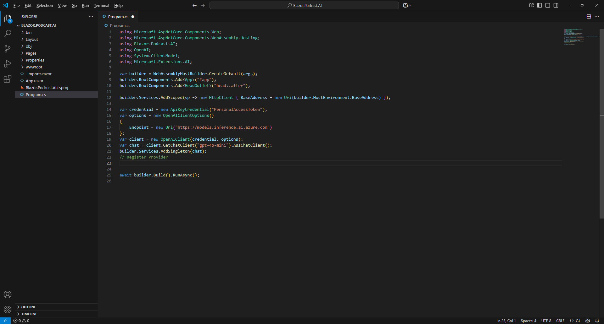

Then within **Program.cs** you will need to replace the placeholder of **PersonalAccessToken** by _Pasting_ the **Personal Access Token** that you _Copied_ from **Fine-grained personal access tokens** in **GitHub**.

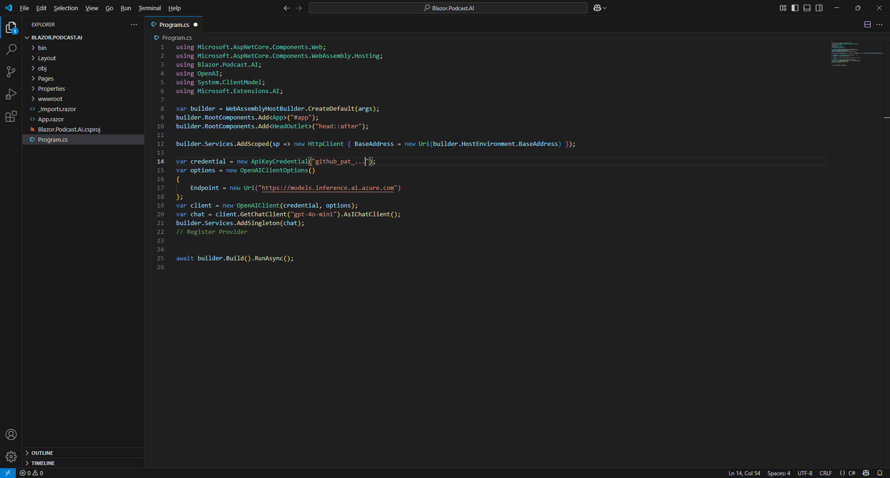

> **Information** – Your **Personal Access Token** can be used here like this as it will just be used on your **Mac** or **Windows** computer but should be it back to **PersonalAccessToken** if sharing anywhere including **GitHub**.

Next, within **Visual Studio Code** from the **Menu** select **File** and then **Save** as follows:

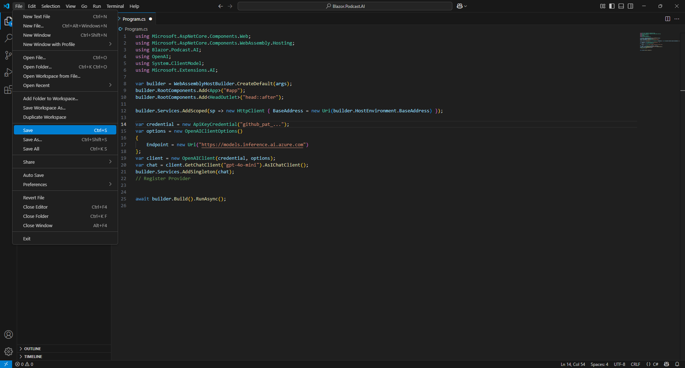

> **Information** – This will **Save** the changes you have made to **Program.cs** which includes the **Usings** and **Code** added for the **Client** along with the **Personal Access Token** to use **GitHub Models**.

This completes the process of getting a **Personal Access Token** from a **GitHub Account** and updating **Program.cs** in the **Project** for **Blazor.Podcast.AI** to include the **Personal Access Token** to be able to access **GitHub Models**.

### Launch Project in Browser

Return to the **Terminal** on **Mac** or **Command Prompt** on **Windows** that was opened earlier as follows:

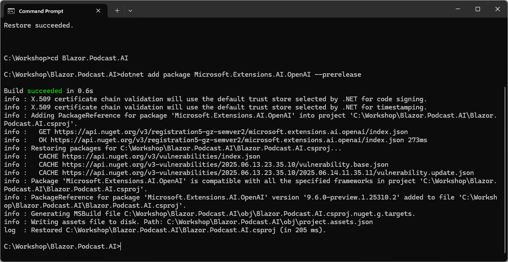

> **Information** - If you closed the **Terminal** on **Mac** then you need to go to **Finder**, search for **Terminal** and then select it to **Open** it, or if you closed the **Command Prompt** on **Windows** you need to go to **Start**, search for **Command Prompt** and then select it to **Open** it. Then once opened you need to change directory using **cd** to the location for your **Project**, for example _cd Blazor.Podcast.AI_.

Then in **Terminal** on **Mac** or **Command Prompt** on **Windows** you then need to _Copy_ and _Paste_ the following **Command** and then press **Enter**:

```
dotnet watch
```

> **Information** - If the **Terminal** on **Mac** or **Command Prompt** on **Windows** displays any **Errors**, then make sure that everything was entered correctly into **Program.cs** by going over previous **Steps** to double check it matches what you have but once any corrections have been made and **Saved** or there are no **Errors** then the **Build** should proceed.

Once the **Command** has completed successfully the **Terminal** on **Mac** or **Command Prompt** on **Windows** should display as follows:

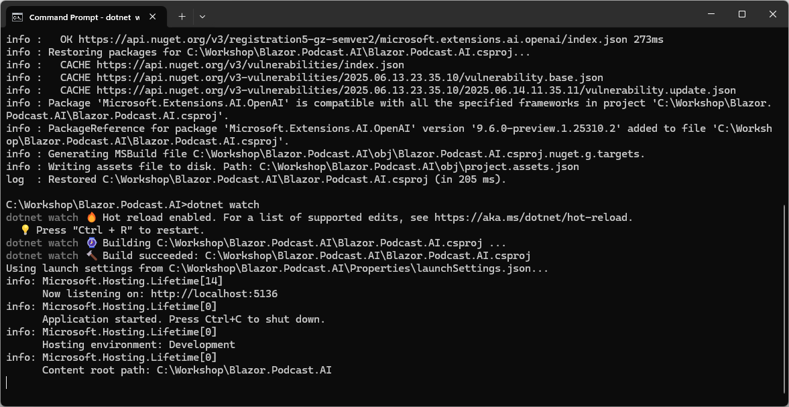

> **Information** – You will be using _Copy_ and _Paste_ for each piece of **Code** but to avoid any issues the key thing to remember in **C#** is balance, so a **Curly Brace** of `{` will always have a counterpart of `}` also applies to **Square Brackets** which should have both `[` and `]` and **Brackets** which should have always have `(` and `)` along with **Double** **Quotes** which should be in pairs so if see `"` at the start there should be another `"` at the end. Also make sure where you see any **Semi-Colons** or `;` to include them where needed as it can often be the smallest mistake that is easiest to fix makes your **Code** work when corrected although any indentation including **Tabs** won’t affect any behaviour. **Errors** will give you an idea where to look including the line number of the **File** which will make them easier to find and give you some idea of what you did wrong so you can correct any mistake.

Also once the **Command** has completed in **Terminal** on **Mac** or **Command Prompt** on **Windows** and there are no **Errors** then the following will be displayed in a  **Browser**:

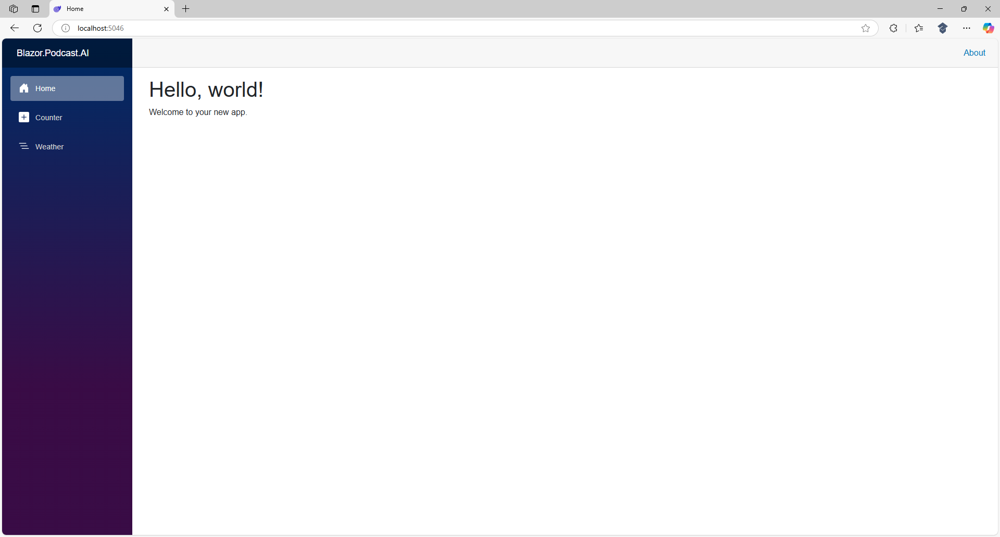

> **Information** – If you don’t see anything like this in a **Browser** then check anything you might have missed in the **Workshop**. Otherwise, this already is your first or working **Blazor** application that you can even use and interact with, including **Counter** and **Weather**, although it doesn’t yet perform any of the actions specific to **Blazor.Podcast.AI**.

Don’t **Close** the **Visual Studio Code** for your **Project** of **Blazor.Podcast.AI** but if **Visual Studio Code** is **Closed**, then if using a **Mac** you need to go to **Finder**, search for **Visual Studio Code** and then select it to **Open** it again, or if using **Windows** you need to go to **Start**, search for **Visual Studio Code** and select it so it is **Open** again. Then from **Welcome** in **Visual Studio Code** select **Blazor.Podcast.AI** from **Recent**.

Don't **Close** the **Command Prompt** on **Windows** or **Terminal** on **Mac** but if it is **Closed** then you need to go to **Finder**, search for **Terminal** and then select it to **Open** it, or if you **Closed** the **Command Prompt** on **Windows** you need to go to **Start**, search for **Command Prompt** and then select it to **Open** it. Then once opened you need to change directory using **cd** to the location for your **Project**, for example _cd Blazor.Podcast.AI_ and then you need to type `dotnet watch` followed by **Enter**.

Don’t **Close** the **Browser** but if it is **Closed** within **Terminal** on **Mac** or **Command Prompt** on **Windows** press the **Ctrl** key along with **C** on your **Keyboard** or on a **Mac** press **Command** along with **C** and then type `dotnet watch` again followed by **Enter** which should relaunch the **Browser**.

This completes the process of launching the **Project** of **Blazor.Podcast.AI** in a **Browser**.

## Implement

### Provider Class

In **Visual Studio Code** select **Program.cs** in **Explorer** then choose **New File…** next to **Blazor.Podcast.AI**.

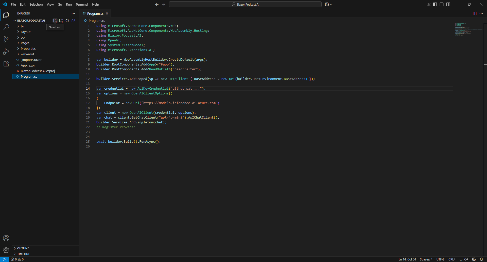

Then _Type_ in the following **Name** and press **Enter** after which you should see or select a blank **Provider.cs** in **Explorer** within **Visual Studio Code**.

```
Provider.cs
```

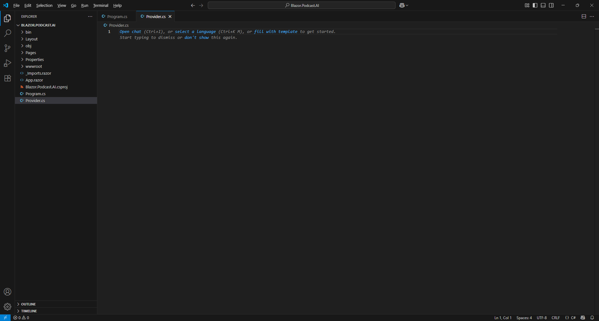

Then within **Visual Studio Code** in **Provider.cs** you need to _Copy_ and _Paste_ the following **Code**:

```csharp
using Microsoft.Extensions.AI;

namespace Blazor.Podcast.AI;

public class Provider(IChatClient chat)
{
    // System Prompt

    // Cancellation

    // Properties

    // Send Method

    // Cancel & New Methods

}
```

> **Information** – This forms the outline of a `class` for **Provider**, a **Class** is used to group together **Code** or can be used to represent an **Object**. The first line is a `using` for functionality needed from the **Package** of **Microsoft.Extensions.AI.OpenAI**. Then there is a `namespace` for **Blazor.Podcast.AI** which is followed by the `class` which is defined for **Provider** including `IChatClient` which was **Registered** in **Program.cs** which is provided to the `class` with **Dependency Injection** in a **Primary Constructor** which is used to provide anything needed for a `class` in a concise readable manner. There are also **Comments** which are the lines starting with `//` which will help you place **Code** from the next few **Steps** of the **Workshop**.

Next within **Visual Studio Code** in **Provider.cs** underneath `// System Prompt` you need to _Copy_ and _Paste_ the following **Code**:

```csharp
private const string system = @"
You are a friendly and useful assistant that will help with podcast planning
that is based on answers to questions, always state detailed opinions on 
anything asked of you then suggest title and short description for 
the podcast, segments for each episode, first five episode ideas, 
ideas to make it unique and generate a script for a trailer.
Only use simple html and no markdown to format responses";
```

> **Information** – This **Code** defines a **Constant** or `const` which is something that does not change when your application is running and is `private` as it is only used within the `class` of **Provider**. It is a **string** which is a **Types** which defines the kind of data I can have which in this case is text for a **System Prompt** within a pair of **Double Quotes** and ending with a **Semi-Colon**. A **System Prompt** is a set of instructions given to an **AI Model** that acts as a set of rules to guide how it behaves and responds along with any capabilities. In this case it will be a friendly and useful assistant that will help with **Podcast** planning including suggesting titles, description, segments, episode ideas, how to make it unique plus a generate a script for a trailer. The **System Prompt** can also be used to control how the **Response** will be formatted which normally uses **Markdown**, a special language for formatting text, but instead we want to use simple **HTML** which is used to format output for a **Browser**.

Then within **Visual Studio Code** in **Provider.cs** underneath `// Cancellation` you need to _Copy_ and _Paste_ the following **Code**:

```csharp
private CancellationTokenSource? cancel;
```

> **Information** – This **Code** defines a **Variable** which is something that does change when your application is running and is `private` as it is only used within the `class` of **Provider**, these kinds of **Variable** within a `class` are also known as **Members**. This **Variable** is a **Type** of `CancellationTokenSource` which will be used to provide a **Cancellation Token** to **Cancel** any **Response** and it is followed by a **Question Mark** or `?` meaning that it is **Nullable** which means it can have no **Value** before it is given one with `new()` later.

Next within **Visual Studio Code** in **Provider.cs** underneath `// Properties` you need to _Copy_ and _Paste_ the following **Code**:

```csharp
public string Title { get; } = "Blazor Podcast AI";

public string Label { get; } = "Optionally refine with details or questions";

public Dictionary<string, List<string>> Questions { get; } = new()
{       
    { "Podcast is about", [string.Empty] },
    { "Host of podcast is", [string.Empty] },
    { "Listener of podcast is", [string.Empty] },
    { "Format of podcast is", 
    ["Solo", "Interview", "Cohosted", "Roundtable", "Audiobook"] },
    { "Purpose of podcast is", 
    ["Community", "Discussion", "Education", "Experience", "Entertainment"] }
};

public List<ChatMessage> Messages { get; set; } = [new(ChatRole.System, system)];

public bool IsQuestions { get; set; } = true;

public bool IsGenerating { get; set; } = false;
```

> **Information** – The first **Property**, which are normally **public** meaning they can be used inside and outside the **class** of **Provider**, is a `string` for a **Title** only has a `get` as it just returns the **Value**, the second **Property** is for a `string` for a **Label** which also only has a `get`, then this is followed by set of **Questions** which also just returns a **Value** and the **Type** of this **Property** is a `Dictionary` which is used to store a **Value** which in this case it is a **List** of text or `string` using a **Key**. The **Keys** are items such as `"Podcast is about"` and the **Values** for the **List** are set using **Square Brackets** to a set with one `string` such as `string.Empty` representing a **Value** that is blank or a multiple `string` values such as `"Solo"` which will define an **Answer** to a **Question**. The second **Property** represents a `List` of `ChatMessage` from **Package** of **Microsoft.Extensions.AI.OpenAI** which defines **Requests** or **Responses** set to a `ChatMessage` using **Square Brackets** to the **System Prompt** using `ChatRole.System`. The final two **Properties** with a **Type** known as a **Boolean** or `bool` which can be `true` or `false` will control when **Questions** or **Generating** should be displayed.

While still within **Provider.cs** in **Visual Studio Code** underneath `// Send Method` you need to _Copy_ and _Paste_ the following **Code**:

```csharp
public async Task Send(string message)
{
    cancel = new();
    IsGenerating = true;
    IsQuestions = false;
            
    Messages.Add(new ChatMessage(ChatRole.User, message)); 
            
    var response = await chat.GetResponseAsync([.. Messages], null, cancel.Token);
    var assistant = new TextContent(response.Text);

    Messages.Add(new ChatMessage(ChatRole.Assistant, [assistant]));

    IsGenerating = false;
}
```

> **Information** – `Send` is a **Method**, which is a way to create a reusable block of **Code**, they can be provided with **Values** known as **Parameters** which will be a `string` for `message`, and it is `public` which means it can be used outside the `class` of **Provider**. This **Method** also **Returns** a **Task**, used for **Code** that runs in the background, within the **Method** the **Member** of `cancel` is **Initialised** with `new()` and below this the two **Properties** of `IsGenerating` and `IsQuestions` are set as needed. The `message` that was provided to the **Method** is added to the **Property** of the `List` of `ChatMessage` as `ChatRole.User` which represents any **Requests**. Then a **Variable** of `response` is set using `await` which is **Code** that will run in the background to the result of the **Method** of `GetResponseAsync` for getting the **Response** using `IChatClient` that was provided to the `class` with **Parameters** for the `List` of `ChatMessage`, an unused **Parameter** provided with `null` and then a `Token` from the **Cancellation Token** . Then a **Variable** with the **Type** of `TextContent` of `assistant` is created using the **Value** of `response` which is added to the `List` of `ChatMessage` as `ChatRole.Assistant` which represents **Responses**, and `IsGenerating` set to `false` to indicate **Generating** has completed.

Next within **Provider.cs** in **Visual Studio Code** underneath `// Cancel & New Methods` you need to _Copy_ and _Paste_ the following **Code**:

```csharp
public void Cancel()
{            
    cancel?.Cancel();
    IsGenerating = false;
}

public void New()
{
    Cancel();
    IsQuestions = true;
    Messages = [new(ChatRole.System, system)];
}
```

> **Information** – Theses **Methods** don’t **Return** any values, so they are `void` and are `public` which means they can be used outside the `class` of `Provider`. The first **Method** of `Cancel` is used to stop any current **Response** from the **AI Model** and the **Method** of `New` will start a new conversation with the **AI Model** which includes resetting the **Property** for the `List` of `ChatMessage` to the **System Prompt**.

Next, within **Visual Studio Code** from the **Menu** select **File** and then **Save** as follows:

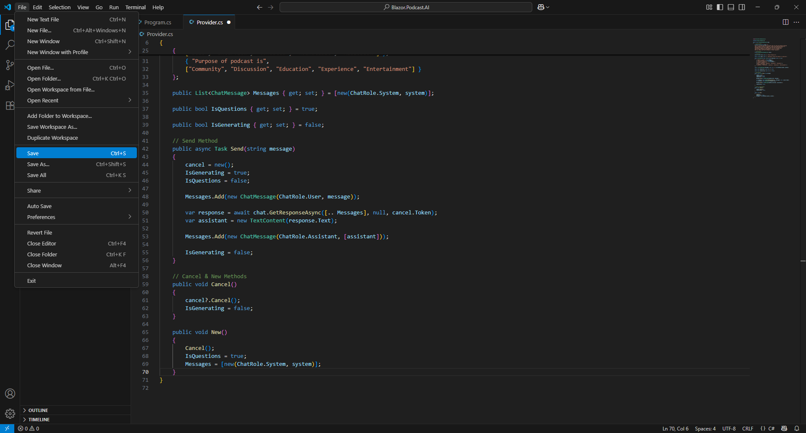

> **Information** - If the **Terminal** on **Mac** or **Command Prompt** on **Windows** displays any **Errors**, then make sure that everything was entered correctly into **Provider.cs** by going over previous **Steps** to double check it matches what you have but once any corrections have been made and **Saved** or there are no **Errors** then the **Build** should proceed.

Then within **Visual Studio Code** select **Program.cs** from **Explorer** as follows:

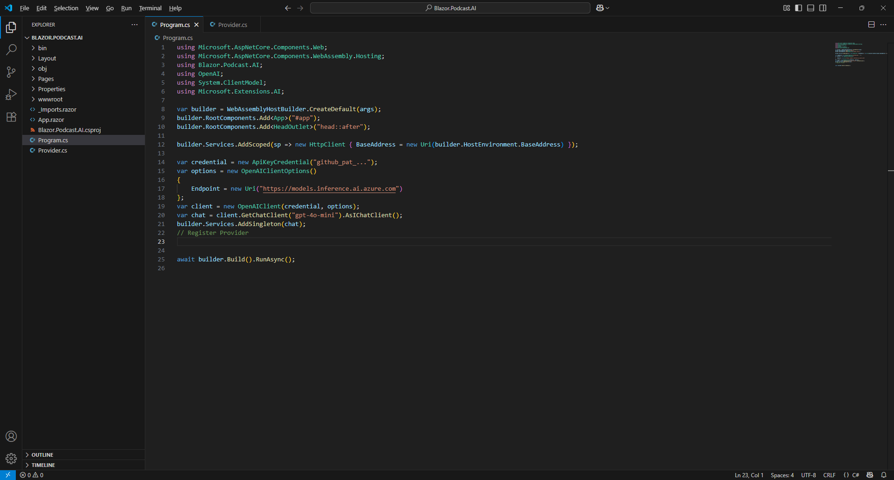

In **Program.cs** below **Comment** of `// Register Provider` need to _Copy_ and _Paste_ the following **Code**:

```csharp
builder.Services.AddSingleton<Provider>();
```

Finally, within **Visual Studio Code** from the **Menu** select **File** and then **Save** as follows:

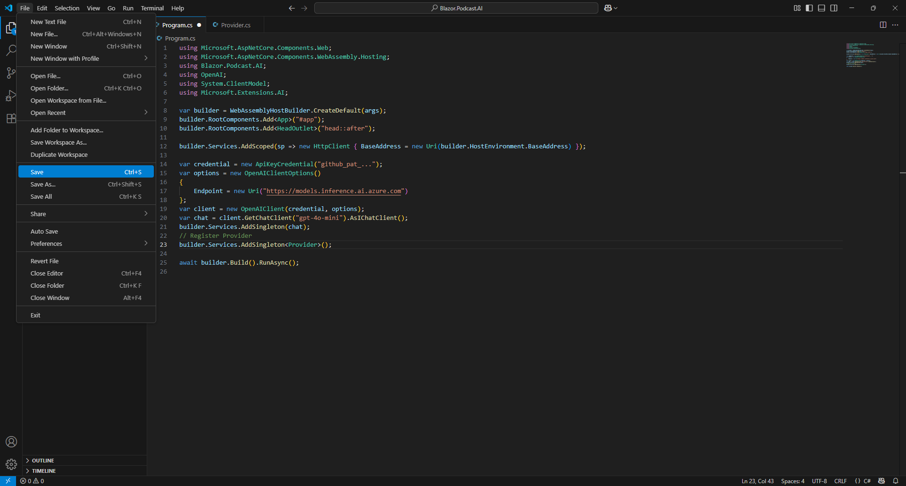

This completes the process in **Visual Studio Code** of creating and **Registering** the **Provider**.

### Item Component

In **Visual Studio Code** select **Program.cs** in **Explorer** then choose **New File…** next to **Blazor.Podcast.AI**.

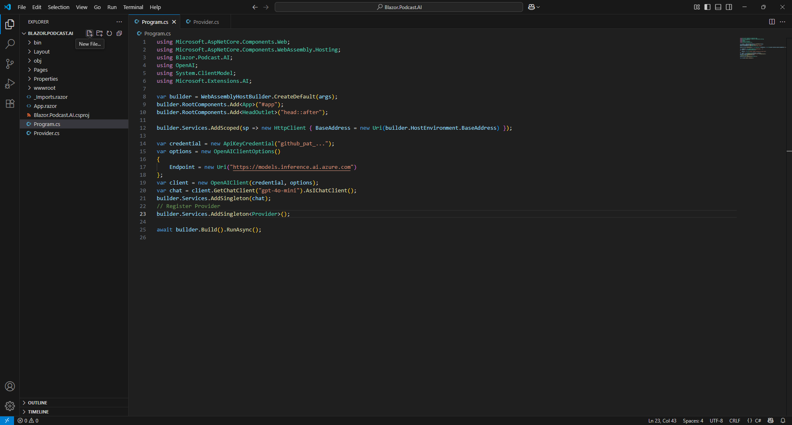

Then _Type_ in the following **Name** and press **Enter** after which you should see or select a blank **Item.razor** in **Explorer** within **Visual Studio Code**.

```
Item.razor
```

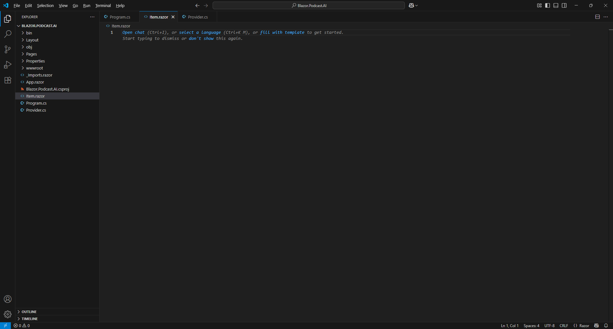

Then within **Visual Studio Code** in **Item.razor** you need to _Copy_ and _Paste_ the following **Razor**:

```razor
@using Microsoft.Extensions.AI

@* Messages *@

@code {
    [Parameter]
    public required ChatMessage Message { get; set; }
}
```

> **Information** – This forms the outline of a **Component** in **Razor** which combines **HTML** used to output in a **Browser** with **C#** in **Blazor**. The first line of `using` is for functionality needed in the **Component** from the **Package** of **Microsoft.Extensions.AI.OpenAI**. There is also a **Comment** which in **Razor** starts with `@*` and ends with `*@` and **code** with the **Property** of `ChatMessage` which will be a **Parameter** of the **Component**.

Then within **Visual Studio Code** in **Item.razor** underneath `@* Messages *@` you need to _Copy_ and _Paste_ the following **Razor**:

```razor
@if (Message.Role == ChatRole.User)
{
    <div class="card text-white bg-info m-2">
        <div class="card-header">User</div>
        <div class="card-body">
            @Message.Text
        </div>
    </div>
}
else if(Message.Role == ChatRole.Assistant)
{
    foreach (var content in Message.Contents)
    {
        if (content is TextContent { Text: { Length: > 0 } text })
        {
            <div class="card bg-light m-2">
                <div class="card-header">Assistant</div>
                <div class="card-body">
                    @((MarkupString)text)
                </div>
            </div>
        }
    }
}
```

> **Information** – This will be used to output a `ChatMessage` for `ChatRole.User` or `ChatRole.Assistant` using an `if` statement to check it is **Equal** with `==` to the `Role` from `ChatMessage`. Should the `Role` be `ChatRole.User` then the first block of **Razor** will be output for a **Request** otherwise with `else if` the `Role` is `ChatRole.Assistant` then the second block of **Razor** will be output for a **Response** and only `if` this is `TextContent` with a `Length` greater than `0` using `>` and this will be in **HTML** so `MarkupString` will convert it so that it can be output correctly in the **Browser**.

Next, within **Visual Studio Code** from the **Menu** select **File** and then **Save** as follows:

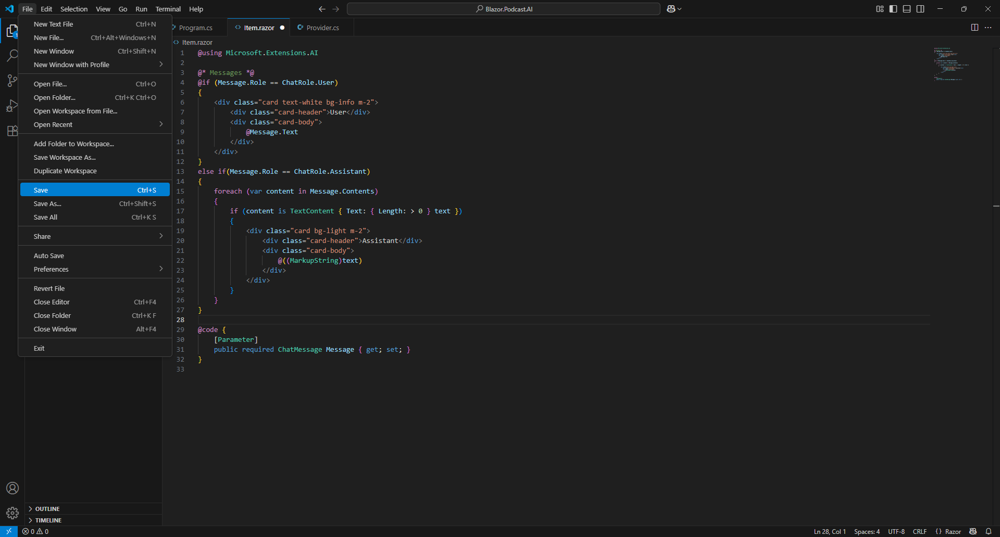

You should double check that everything was entered correctly as if the **Terminal** on **Mac** or **Command Prompt** on **Windows** displays any **Errors** this will be only for any **Code** that was entered into **Item.razor**, so go over the previous **Steps** to double check it matches what you have but once any corrections have been made and **Saved** or there are no **Errors** then the **Build** should proceed.

This completes the **Component** of **Item** to be used to output each **Message** for a **Request** or **Response**.

### Send Component

In **Visual Studio Code** select **Program.cs** in **Explorer** then choose **New File…** next to **Blazor.Podcast.AI**.

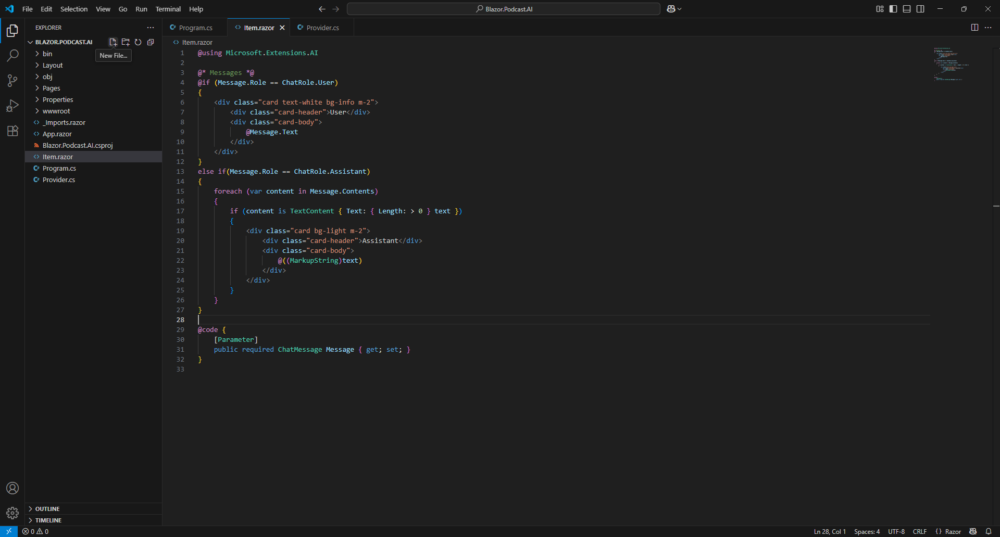

Then _Type_ in the following **Name** and press **Enter** after which you should see or select a blank **Send.razor** in **Explorer** within **Visual Studio Code**.

```
Send.razor
```

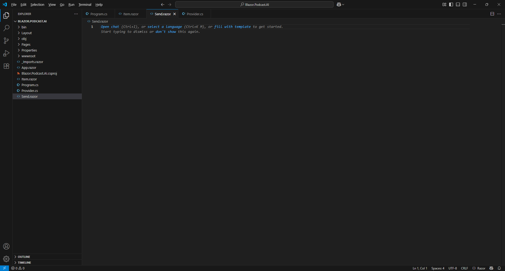

Then within **Visual Studio Code** in **Send.razor** you need to _Copy_ and _Paste_ the following **Razor**:

```razor
@* Edit Form *@

@code {
    // Members

    // Parameters

    // Submit Method

    // OnInitialized Method

}
```

> **Information** – This forms the outline of a **Component** in **Razor** which combines **HTML** used to output in a **Browser** with **C#** in **Blazor**. There is a **Comment** which in **Razor** starts with `@*` and ends with `*@` along with a `code` section with **Comments** starting with `//` which will help you place **Code** for the next few **Steps**.

While within **Visual Studio Code** in **Send.razor** below the **Comment** of `// Members` you need to _Copy_ and _Paste_ the following **Code**:

```csharp
private Dictionary<string, string> answers = new();
private string? message;
```

> **Information** – These **Members** will only be used within the **Component** so they are `private`, the first **Member** is a `Dictionary` where the **Key** will match the ones from any **Questions** but there will be only a single **Answer**, so the **Value** is just a single `string`. The second **Member** is a `string?` that can be nothing.

Next within **Visual Studio Code** in **Send.razor** below the **Comment** of `// Parameters` you need to _Copy_ and _Paste_ the following **Code**:

```csharp
[Parameter]
public string? TextAreaLabel { get; set; }

[Parameter]
public bool IsQuestions { get; set; }

[Parameter]
public Dictionary<string, List<string>> Questions { get; set; } = new();

[Parameter]
public EventCallback<string> OnSend { get; set; }
```

> **Information** – These **Parameters** will be provided to the **Component** and include a `string?` to be used for the **Label** of a **Text Area** and a `bool` to control whether the Questions will be shown or not. There is also a **Parameter** for `Questions` which is the same **Type** as that defined in the **Provider** and there is a **Parameter** for an `EventCallback` which will notify another **Component** when a **Message** needs to be **Sent** from this **Component**.

Then within **Visual Studio Code** in **Send.razor** below the **Comment** of `// Submit Method` you need to _Copy_ and _Paste_ the following **Code**:

```csharp
private async Task Submit()
{
    if (IsQuestions)
    {
        if (message?.Length > 0)
        {
            answers.Add(string.Empty, message);
        }
        if (answers.Values.All(a => !string.IsNullOrWhiteSpace(a)))
        {
            message = string.Join(",", 
            answers.Select(value => $"{value.Key} {value.Value}"));
        }
    }
    if (message is { Length: > 0 } text)
    {
        message = null;
        await OnSend.InvokeAsync(text);
    }
}
```

> **Information** – The **Method** of `Submit` is used to **Send** a **Message**, this could be the **Questions**, which will be indicated `if` the value of `IsQuestions` is `true`. Should this be the case then `if` there was a `message` also **Sent** with the **Questions** this will be added to `answers` with a **Key** that is blank. This is followed by another `if` that check to make sure that all **Questions** have been **Answered** using `All` which is a special **Method** using **LINQ** and it checks to make sure **All** values are `!IsNullOrWhiteSpace` which means not `null`, blank or any other whitespace, if they are they are combined into `message` using another **Method** using **LINQ** of `Select` into one long **Message** separated by a **Comma** using the **Method** of `Join` for a `string`. Finally, there is a check to see if the message has any contents using the Length which produces a **Value** of `text` and then `message` is reset and `OnSend` is triggered with the **Value** of `text`.

Next within **Visual Studio Code** in **Send.razor** below the **Comment** of `// OnInitialized Method` you need to _Copy_ and _Paste_ the following **Code**:

```csharp
protected override void OnInitialized() =>
    answers = Questions.ToDictionary(kvp => kvp.Key, kvp => string.Empty);
```

> **Information** – This is a special **Method** as it replaces the **Method** normally used to set up a **Component** of `OnInitialized` to perform any custom setup, in this case it is setting up `answers` by converting `Questions` into the correct kind of `Dictionary` that it needs with the **Method** of `ToDictionary` with the same **Keys** but a blank value to become an **Answer** to a **Question** that will be input or selected in **Blazor Podcast AI**.

Then within **Visual Studio Code** in **Item.razor** underneath `@* Edit Form *@` you need to _Copy_ and _Paste_ the following **Razor**:

```razor
<EditForm Model="@this" OnValidSubmit="@Submit" class="m-2"> 
    @if(IsQuestions)
    {
        @foreach (var question in Questions.Keys)
        {
            <div class="form-group">
                <label class="form-label">@question</label>
                @if (Questions[question].Count > 1)
                {
                    <select class="form-control mb-2" @bind="@answers[question]">
                        <option value="">Select Option</option>
                        @foreach (var answer in Questions[question])
                        {
                            <option value="@answer">@answer</option>
                        }
                    </select>
                }
                else
                {
                    <textarea class="form-control mb-2" rows="1" 
                    @bind="@answers[question]" />
                }
            </div>
        }
    }
    <div class="form-group">
        <label class="form-label">@TextAreaLabel</label>
        <textarea class="form-control mb-2" rows="2" @bind="@message" />
    </div>
    <button type="submit" class="btn btn-primary mb-2">
        Send
    </button>
    <button type="reset" class="btn btn-secondary mb-2">
        Reset
    </button>
</EditForm>
```

**Information** – `EditForm` is used for input, `if` the **Value** of `IsQuestions` is `true` it will **Loop** through the **Questions** with the `foreach` and `if` the **Answers** for a **Question** is more than `1` using `>` it will use the `Select` from **HTML** to produce a **Dropdown** with the **Answers** to choose from, getting each **Answer** from the **Dictionary** by **Key** using the **Square Brackets**, if there is just one **Answer** then it will use a `TextArea` from **HTML** instead where you can input **Text**. This is then followed by another `TextArea` which has a `Label` from **HTML** using the **Parameter** of `TextAreaLabel` and finally there is a `button` of **Submit** which will trigger the **Method** of `Submit` set in the `EditForm` and a `button` to **Reset** the `EditForm`.

Next, within **Visual Studio Code** from the **Menu** select **File** and then **Save** as follows:

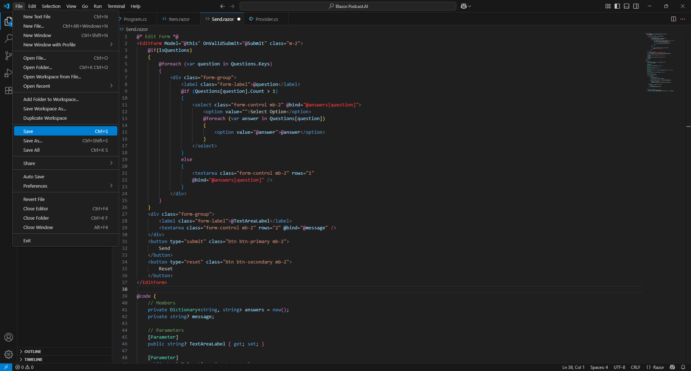

Once **Saved** then return to the **Terminal** on **Mac** or **Command Prompt** on **Windows** and you will see an **Error** that **Adding an abstract method or overriding an inherited method requires restarting the application**, and it will ask **Do you want to restart your app? Yes (y) / No (n) / Always (a) / Never (v)** if you _Type_ in **y** this will restart the application and reload your **Browser**.

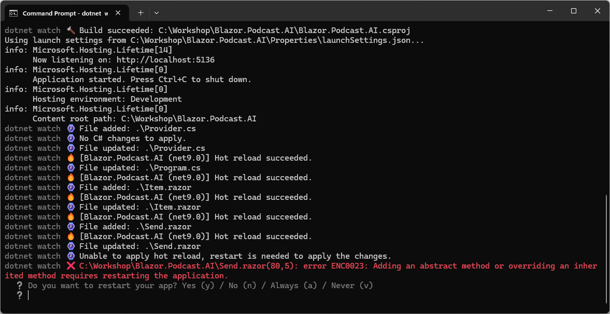

> **Information** - If you look out for **Hot reload succeeded** in **Terminal** on **Mac** or **Command Prompt** on **Windows** this will indicate that there are no more **Errors**.

However, if the **Terminal** on **Mac** or **Command Prompt** on **Windows** still displays any **Errors** other than that one and **Exited with error code -1** after restarting then you should double check everything was entered correctly as any **Errors** will only for any **Code** that was entered into **Send.razor**, so go over the previous **Steps** to double check it matches what you have but once any corrections have been made and **Saved** or there are no **Errors** then the **Build** should proceed as follows:

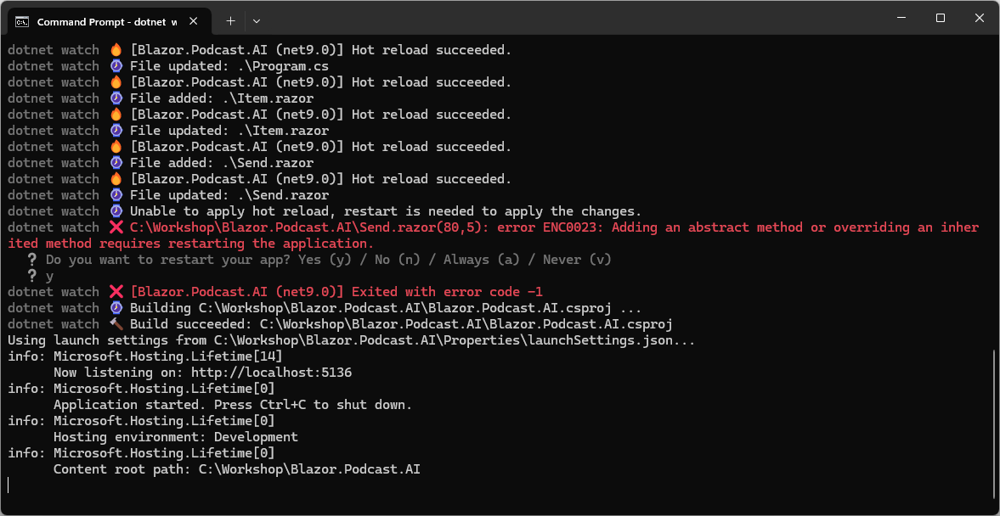

This completes the **Component** that will be used to **Send** a **Request** including the initial set of **Questions**.

### Home Component

In **Visual Studio Code** in **Explorer** select **Pages** and then select **Home.razor** as follows:

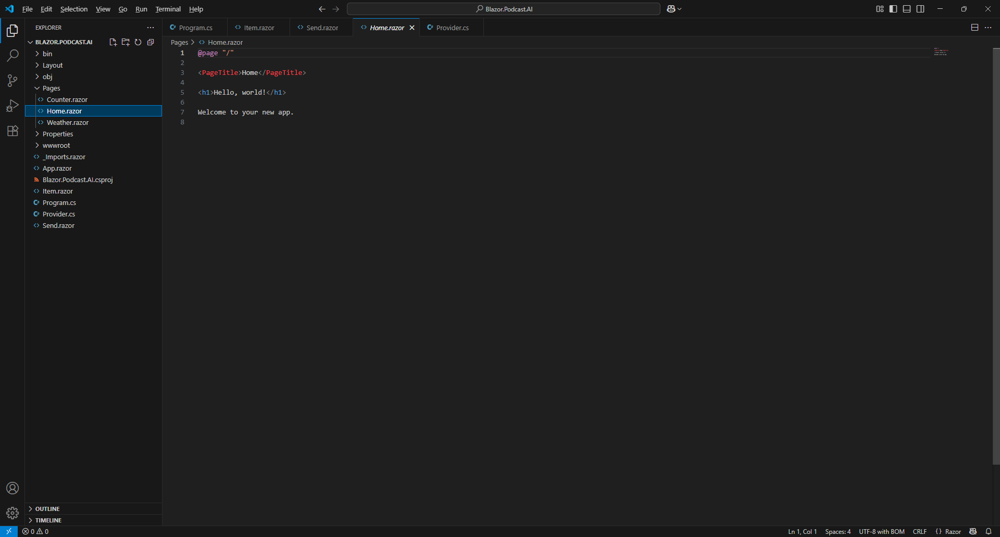

> **Information** – This defines the **Content** for the **Page** that is displayed in your **Browser** using **Razor**.

Then you need to remove everything from **Home.razor** so it appears as follows:

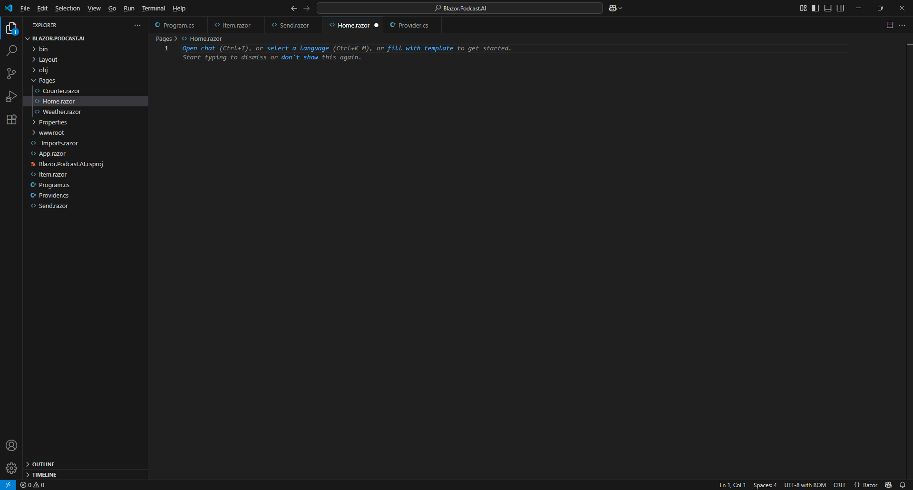

Once within **Home.razor** in **Visual Studio Code** you need to _Copy_ and _Paste_ the following **Razor**:

```razor
@page "/"
@inject Provider provider

<PageTitle>@provider.Title</PageTitle>

<h1>@provider.Title</h1>

@* New & Items *@

@* Output *@

```

> **Information** – This forms the outline of a **Page** in **Razor** which combines **HTML** used to output in **Browser** with **C#** in **Blazor** which is indicated with the **Directive** of `page` at the top which is then followed by the **Provider** which is provided by **Dependency Injection** with the **Directive** of `inject`. There is a new `PageTitle` and `H1` which uses `Title` from the **Provider**, followed by **Comments** which in **Razor** start with `@*` and end with `*@` which will help you place **Code** from the next few **Steps**.

Then within **Visual Studio Code** in **Home.razor** underneath **@\* New & Items \*@** you need to _Copy_ and _Paste_ the following **Razor**:

```razor
<button class="btn btn-outline-primary m-2" @onclick="@provider.New">
    New
</button>

@foreach (var message in @provider.Messages)
{
    <Item @key="@message" Message="@message" />
}
```

> **Information** – There is a **Button** in **HTML** for **New** which when **Clicked** will trigger the **Method** of `New` in the **Provider** using `onclick`. This is followed by a `foreach` which will **Loop** through each **Message** in the **Property** of `Messages` in the **Provider** and then use the **Component** of `Item` to output each **Message**.

Then within **Visual Studio Code** in **Home.razor** underneath `@* Output *@` you need to _Copy_ and _Paste_ the following **Razor**:

```razor
@if (provider.IsGenerating)
{
    
    <div class="card bg-light m-2">
        <div class="card-header">Generating</div>
        <div class="card-body">
            <div class="spinner-border text-black" role="status">
                <span class="sr-only"></span>
            </div>
        </div>
        <div class="card-footer">
            <button class="btn btn-secondary m-2" @onclick="@provider.Cancel">
                Cancel
            </button>
        </div>
    </div>    
}
else
{
    <Send IsQuestions="@provider.IsQuestions"
    Questions="@provider.Questions" OnSend="@provider.Send"
    TextAreaLabel="@provider.Label"/>    
}
```

> **Information** – When `IsGenerating` is `true` then it will output the block of **Razor** that also includes a `button` to **Cancel** which will trigger the **Method** of `Cancel` in the **Provider** using `onclick`. However, when `IsGenerating` is `false` it will output the **Component** of `Send` and will provide the **Parameters** from the **Provider** including `IsQuestions` and `Questions` along with when `OnSend` is triggered that this is handled by the **Method** of `Send` in the **Provider** and set the `TextAreaLabel` to`Label`.

Finally, within **Visual Studio Code** from the **Menu** select **File** and then **Save** as follows:

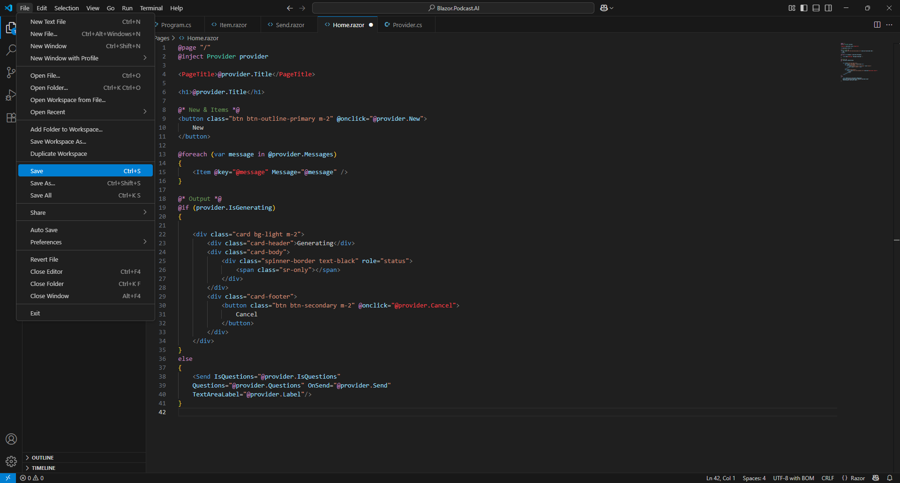

You should double check that everything was entered correctly as if the **Terminal** on **Mac** or **Command Prompt** on **Windows** displays any **Errors** this will be only for any **Code** that was entered into **Home.razor**, so go over the previous **Steps** to double check it matches what you have but once any corrections have been made and **Saved** or there are no **Errors** then the **Build** should proceed.

Don’t **Close** the **Visual Studio Code** for your **Project** of **Blazor.Podcast.AI** but if **Visual Studio Code** is **Closed**, then if using a **Mac** you need to go to **Finder**, search for **Visual Studio Code** and then select it to **Open** it again, or if using **Windows** you need to go to **Start**, search for **Visual Studio Code** and select it so it is **Open** again. Then from **Welcome** in **Visual Studio Code** select **Blazor.Podcast.AI** from **Recent**.

Don't **Close** the **Command Prompt** on **Windows** or **Terminal** on **Mac** but if it is **Closed** then you need to go to **Finder**, search for **Terminal** and then select it to **Open** it, or if you **Closed** the **Command Prompt** on **Windows** you need to go to **Start**, search for **Command Prompt** and then select it to **Open** it. Then once opened you need to change directory using **cd** to the location for your **Project**, for example _cd Blazor.Podcast.AI_ and then you need to type `dotnet watch` followed by **Enter**.

Don’t **Close** the **Browser** but if it is **Closed** within **Terminal** on **Mac** or **Command Prompt** on **Windows** press the **Ctrl** key along with **C** on your **Keyboard** or on a **Mac** press **Command** along with **C** and then type `dotnet watch` again followed by **Enter** which should relaunch the **Browser**.

This completes the **Page** of **Home** that will be used to output or input any **Messages** including **Questions** and this also completes creating a **Podcast Assistant** in **Blazor** using **GitHub Models** for the **Workshop**.

## Generate

### Podcast Assistant

Switch over to the **Browser** that would have been opened by the **Terminal** on **Mac** or **Command Prompt** on **Windows** as follows:

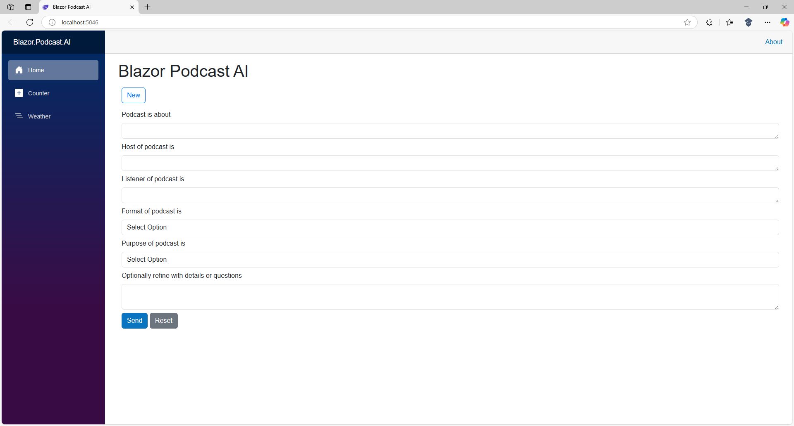

> **Information** – If your **Home** in the **Browser** does not look like this then **Refresh**. If it still does not look like this then look go through the previous **Steps** in the **Workshop** to see if you missed anything or got anything wrong, pay particular attention to any **Razor** as this may not have triggered an **Error** but could be incorrect or in the wrong place.

You can start a new **Conversation** with **New** or **Cancel** any **Response** being **Generated**. **GitHub Models** does limit any **Requests** that are **Sent** and **Responses** that are **Generated** each day as it is free to use. When you do hit the limit then **Blazor Podcast AI** will stop working but it will start working again after twenty-four hours as the limit will be reset for **GitHub Models**.

> **Information** – **GitHub Models** can be replaced by paid-for **AI** **Models** that can be used as often as you want, although they cost money depending on how many **Requests** are made or how large they are along with how many **Responses** are **Generated** and how large those are. These costs vary depending on the **Model** used but generally they can be quite small, but this can add up but when experimenting then using them for free is ideal such as with **GitHub Models**.

Once in the **Browser** for **Blazor Podcast AI** start by **Answering** the **Questions**, the first **Podcast is about** can be answered with any topic such as _Blazor_, _GitHub Models_ or anything you want, the second **Host of podcast is** can be answered with your name and the third **Listener** **of podcast is** can be the kind of listener such as beginner or details about the person you’re aiming to reach. There are also **Questions** for **Format of podcast is**, and **Purpose of podcast is** where you can pick from a set of **Answers** in a **Dropdown** to pick the format or purpose that you think would make a good podcast. **Optionally** you can refine with more information, but you can leave it blank, but you must **Answer** the **Questions** for example as follows:

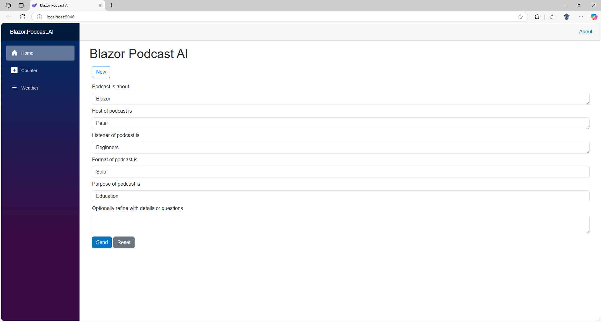

Then in the **Browser** for **Blazor Podcast AI** select **Send** to start **Generating** as follows:

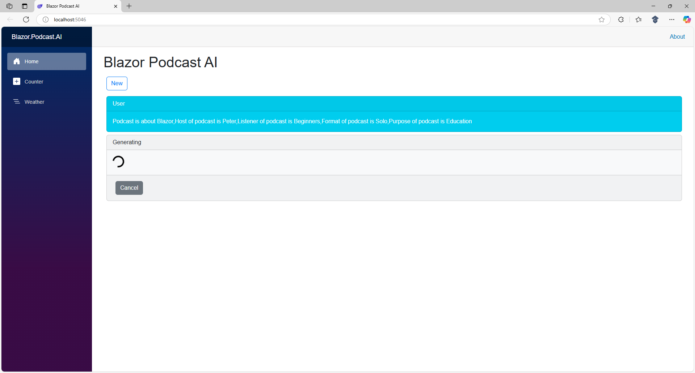

Once **Generating** has completed in the **Browser** for **Blazor Podcast AI** you will see a **Response** from the **Assistant** which for example will be as follows:

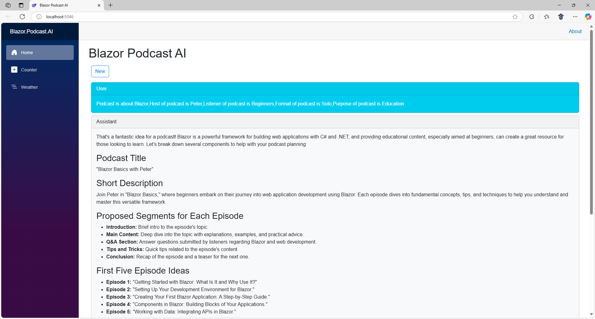

**Response** may be just want you want but generally when using **AI**, you need to amend or adjust until you get what you want by asking questions or providing information to refine a **Response**, you can do this by **Scrolling** down the **Page** and then select the **Text Area** for **Optionally refine with details or questions** and for example you may have changed your mind about the topic so _Type_ in **Make it about .NET instead** or anything else you want to change as follows:

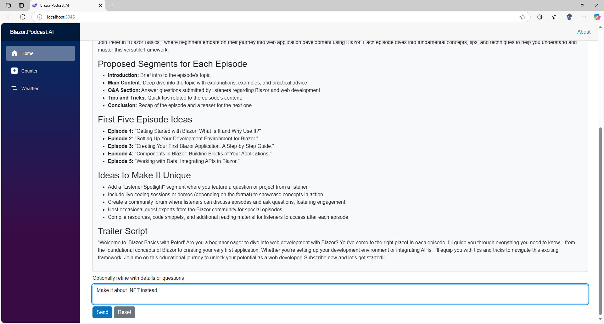

Then in the **Browser** for **Blazor Podcast AI** select **Send** to start **Generating** and once completed you should see your refined output for example the podcast will now be about **.NET** as follows:

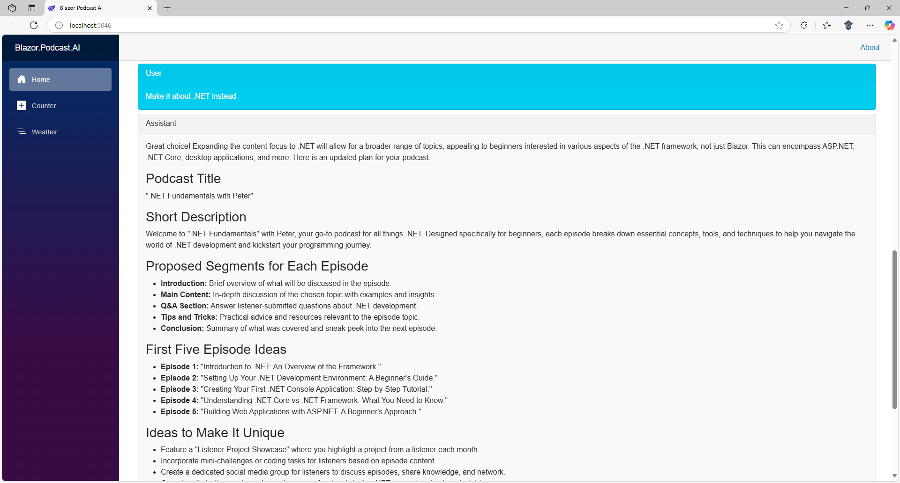

You could also expand on suggestions for example by _Typing_ in **Can you expand on episode one?** in the **Text Area** for **Optionally refine with details or questions** and then select **Send** and once **Generating** has completed you can then review any **Response** for example as follows:

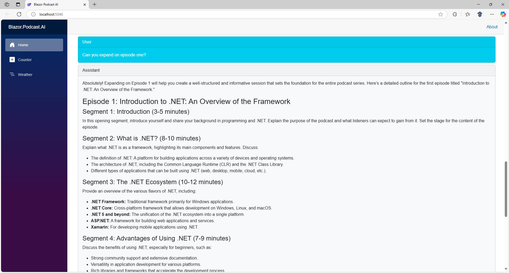

This completes using the **Podcast Assistant** in **Blazor** with **GitHub Models** for the **Workshop**.

### Custom Assistant

**Podcast Assistant** allows you to get started with you own **Podcast**, but with some modifications you can create a **Custom Assistant** that can do anything else, so return to **Visual Studio Code** as follows:

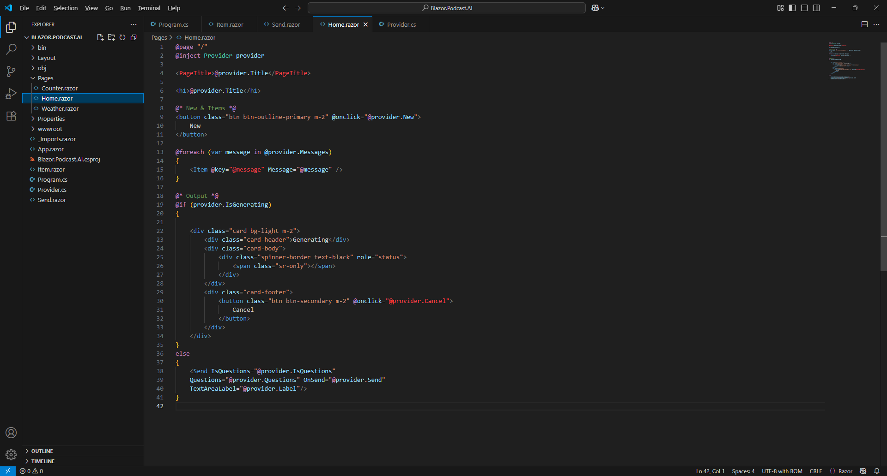

Next from **Explorer** in **Visual Studio Code** select **Provider.cs** as follows:

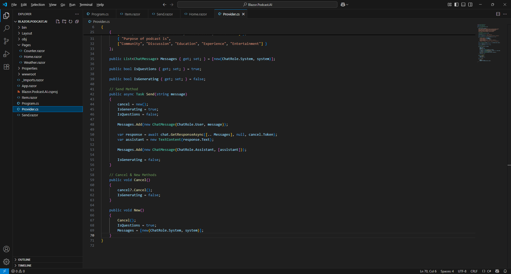

> **Information** – You can also select **Provider.cs** from the **Tabs** at the top of **Visual Studio Code**.

Then in **Visual Studio Code** within **Provider.cs** in the **Method** of **New** you need to change `IsQuestions` from being assigned to `true` to being assigned to `false` instead, so the **Method** of `New` is as follows:

```csharp
public void New()
{
    Cancel();
    IsQuestions = false;
    Messages = [new(ChatRole.System, system)];
}
```

> **Information** – This change will make sure that the **Questions** are not shown when choosing **New** in the **Browser** as this is only needed for the **Podcast Assistant**.

Next in **Visual Studio Code** within **Provider.cs** you need to change the **Property** of `IsQuestions` from it being initialised from `true` to `false` instead, so the **Property** of `IsQuestions` is as follows:

```csharp
public bool IsQuestions { get; set; } = false;
```

> **Information** – This change will make sure that the **Questions** are not shown when starting the application in the **Browser** as this is only needed for the **Podcast Assistant**.

Then in **Visual Studio Code** within **Provider.cs** you need to change the **Property** of `Label` from it being initialised from **Optionally refine with details or questions** to the following:

```
Provide content for social media or questions
```

The **Property** of `Label` should now be as follows:

```csharp
public string Label { get; } = "Optionally refine with details or questions";
```

**Information** – This can be anything that makes sense for your **Custom Assistant**, so people know what to do when using it for the first time or using it throughout to **Generate** what they need.

Next in **Visual Studio Code** within **Provider.cs** you need to change the **Property** of `Title` from it being initialised from **Blazor Podcast AI** to the following:

```
Social Media AI
```

The **Property** of `Title` should now be as follows:

```csharp
public string Title { get; } = "Social Media AI";
```

> **Information** – This can be changed to anything that makes sense for your **Custom Assistant**.

Then you need to update the **System Prompt**, this is the `const` for the `string` of `system` near the top of the **Provider** to change the behaviour from a **Podcast Assistant** to your own **Custom Assistant**, you should leave the `You are a friendly and useful assistant` part of the **System Prompt** along with `Only use simple html and no markdown to format responses` but otherwise you can change the **System Prompt** to behave like anything such as a **Social Media Assistant** as follows:

```csharp
private const string system = @"
You are a friendly and useful assistant that will help with social media
to create engaging posts adapted for main social media platforms also
include any suitable hashtags, offer advice on content scheduling, 
latest trends and any best practices to maximise visibility.
Only use simple html and no markdown to format responses";
```

> **Information** – You can define any behaviour using a **System Prompt** for your **Custom Assistant** in this case it is one that helps with social media to create engaging posts for the main social media platforms and include any suitable hashtags along with offering advice on scheduling content plus latest trends and best practices to maximise visibility. Your **Custom Assistant** could be a creative catalyst for suggesting ideas, provoke challenging conversations or it could be a specialised expert in a specific area to offer guidance. You can even have fun, what would happen if you added _talk like a pirate_ to your **System Prompt**?

Finally, within **Visual Studio Code** from the **Menu** select **File** and then **Save** as follows:

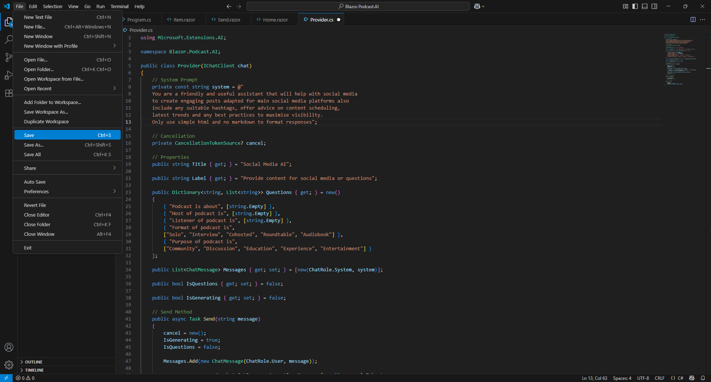

Once **Saved** then return to the **Terminal** on **Mac** or **Command Prompt** on **Windows** and you will see an **Error** that **Updating the initializer of const field requires restarting the application**, and it will ask **Do you want to restart your app? Yes (y) / No (n) / Always (a) / Never (v)** if you _Type_ in **y** this will restart the application reload your **Browser**. 

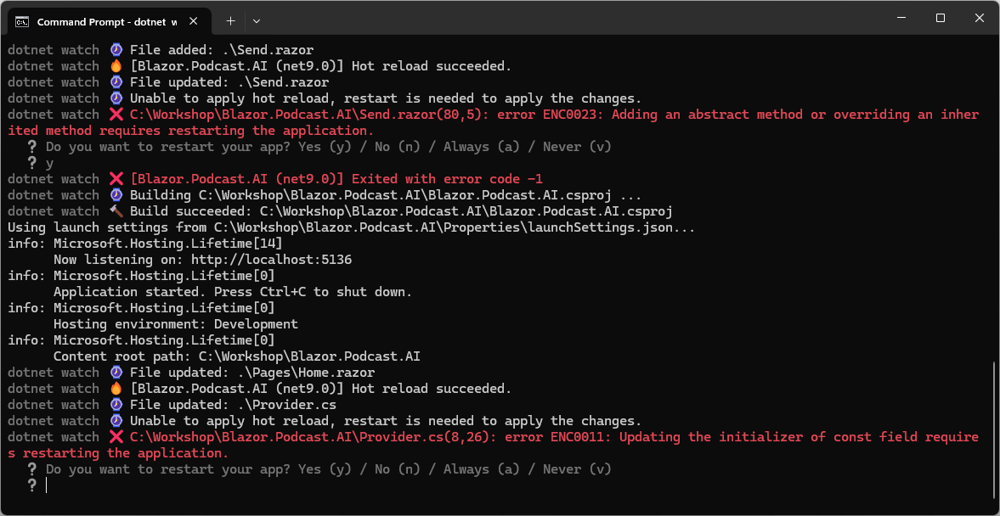

If the **Terminal** on **Mac** or **Command Prompt** on **Windows** still displays any **Errors** other than that one and **Exited with error code -1** after restarting, then you should double check everything was updated correctly in **Provider.cs** from the previous **Steps** of the **Workshop**, or if there are no other **Errors** then the **Build** should proceed as follows:

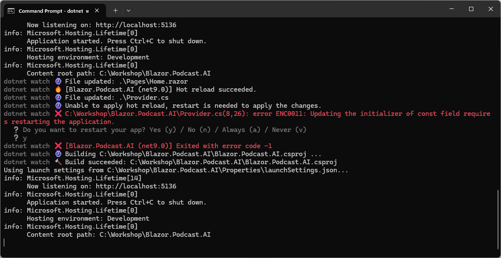

In **Visual Studio Code** you have completed everything for your **Custom Assistant** so now you can switch over to the **Browser** that would have been opened by the **Terminal** on **Mac** or **Command Prompt** on **Windows** as follows:

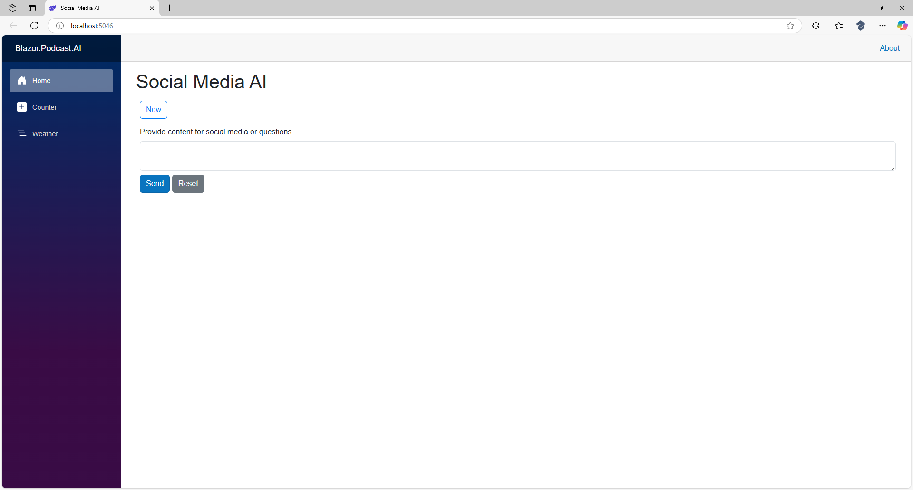

> **Information** – It should display something like this in the **Browser** depending on what **Custom Assistant** you create and in the **Text Area** for **Provide content for social media or questions** you can _Type_ in something such as **GitHub Models**, select **Send** and once **Generating** has completed will be like as follows:

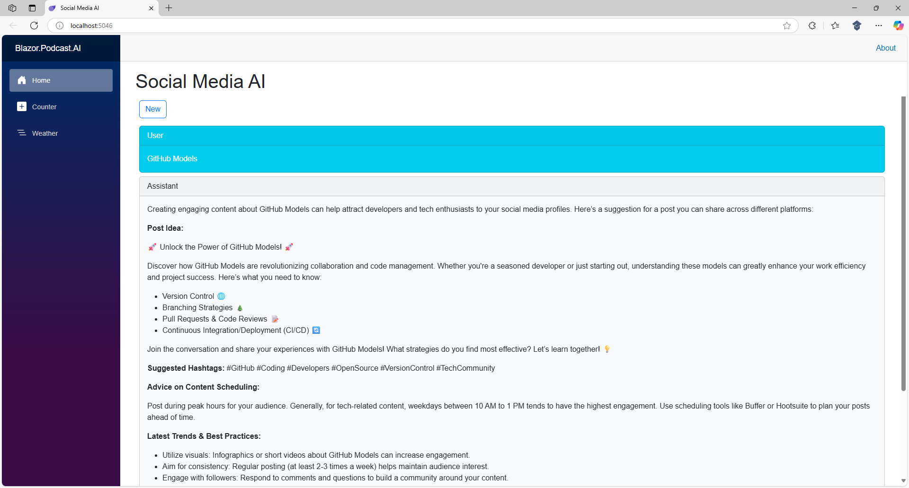

This completes creating a **Custom Assistant** in **Blazor** with **GitHub Models** and concludes the **Workshop** so you can close **Visual Studio Code**, **Browser** and **Terminal** on **Mac** or **Command Prompt** on **Windows**.
